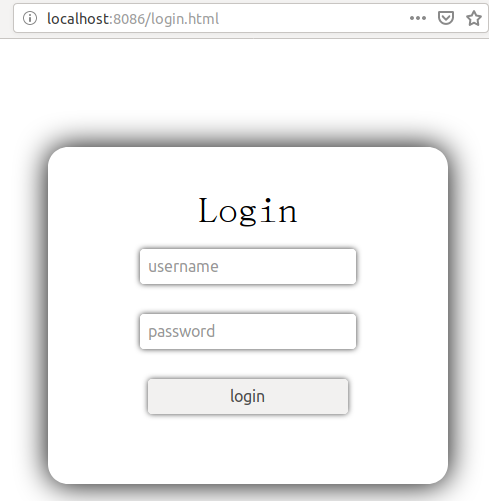
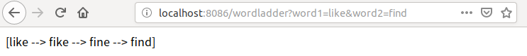

## WordLadder

---

### 1. 使用方法
```
docker run -itd -p 8089:8089 --name wordladder xiaxiao/wordladder:v1.0

docker run -itd -p 8086:8086 --link=wordladder:wordladder --name login xiaxiao/wordladder-login:v1.0
```

### 2. 访问服务
* login
```
http://localhost:8086/login.html
```



* get wordladder
```
http://localhost:8086/wordladder?word1=like&word2=find
```



### 3. 两个独立的service

* login 服务：

   用户访问login服务，登陆后获取权限

* wordladder 服务：
   
   登录成功后，可以访问到wordladder服务。通过转发请求完成。

### 4. Docker

* Repo
  * [xiaxiao\wordladder](https://cloud.docker.com/repository/docker/xiaxiao/wordladder)

  * [xiaxiao\wordladder-login](https://cloud.docker.com/repository/docker/xiaxiao/wordladder-login)

* Dockerfile

  * login's Dockerfile

```
FROM openjdk:8-jdk-alpine
EXPOSE 8086
COPY ./login-0.0.1-SNAPSHOT.jar /home/login.jar
ENTRYPOINT [ "java", "-jar", "/home/login.jar" ]
```

- wordladder's Dockerfile

```
FROM openjdk:8-jdk-alpine
EXPOSE 8089
COPY ./wordladder-0.0.1-SNAPSHOT.jar /home/wordladder.jar
COPY ./txtfile/dictionary.txt  src/txtfile/dictionary.txt
ENTRYPOINT [ "java", "-jar", "/home/wordladder.jar" ]
```