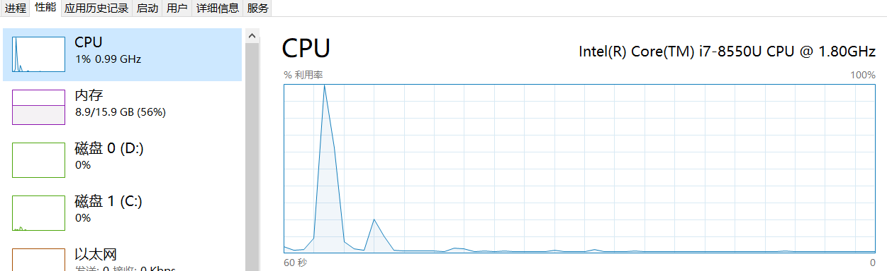
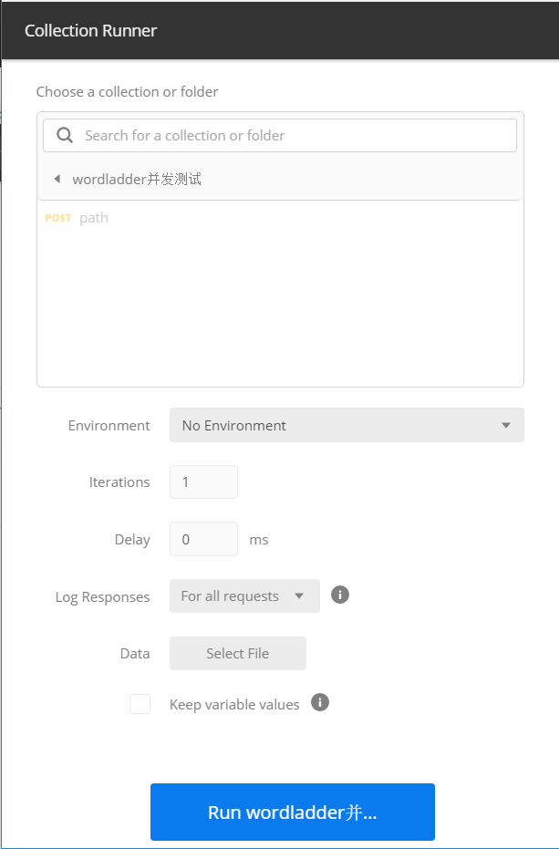
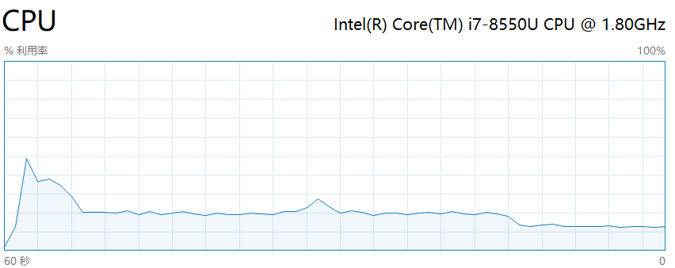
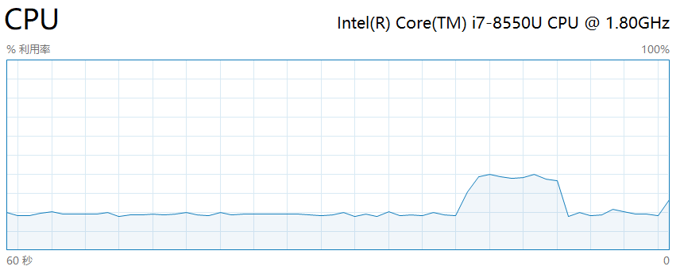

# TaskII

## 1. 机器 0 `request` 下的CPU和Memory的利用率
* CPU: 2%左右
* Memory: 56%

   

## 2. 测试方法
* 基于wordladder作业
* 使用postman发送并发请求。
* Delay为1，每次修改 `Iterations` 提高`request`数量

  

## 3. 测试结果

* Iterations=1: CPU利用率峰值20%。Memory利用率60%
* Iterations=10: CPU利用率峰值30%。Memory利用率61%
* Iterations=100: CPU利用率峰值35%。Memory利用率62%
* Iterations=1000: CPU利用率峰值40%，之后稳定在20%，一段时间后稳定在13%。Memory利用率62%
* Iterations=10000: CPU利用率峰值40%，有多个峰值，稳定值在20%。Memory利用率62%

&emsp;&emsp;(Iterations)1、10、100的测hi结果都仅仅有一个峰值。(Iterations)1000和10000的测试结果如下：

&emsp;&emsp;Iterations=1000

  

&emsp;&emsp;Iterations=10000

  

## 4. 测试总结

&emsp;&emsp; 测试`request`的并发数量指数增长的情况下，CPU的利用率峰值线性增长，但稳定值为20%左右。

&emsp;&emsp;  测试`request`的并发数量指数增长的情况下，Memory的利用率几乎不怎么变化，仅有细微的增长，最高利用率稳定在62%。