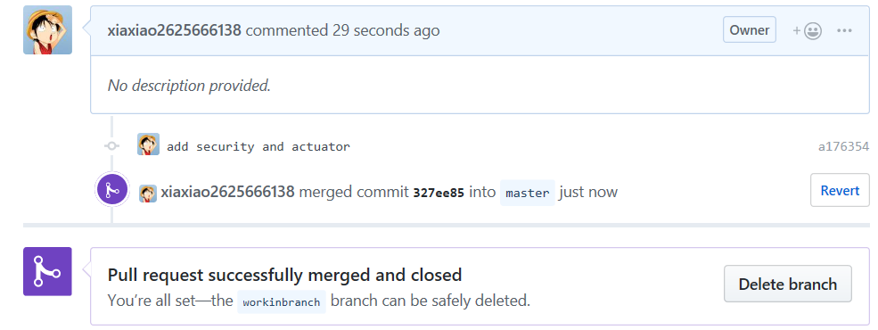

# worldladder 使用说明
## 1. 项目类型
&emsp;&emsp;Spring Initializr web项目
## 2. 运行
&emsp;&emsp;命令行进入项目根目录 `/wordladder`,
```
mvn spring-boot:run
```
&emsp;&emsp;或者直接在intellij中运行项目:

&emsp;&emsp; `wordladder\src\main\java\com\zxz\wordladder\WordladderApplication.java`
## 3. 使用方法
&emsp;&emsp;权限获取:在浏览器地址栏输入
```
http://localhost:8086/login.html
```
&emsp;&emsp;提示输入username和password。
* username: 任意
* password: qwerty

&emsp;&emsp;

&emsp;&emsp;验证通过后自动跳转至`http://http://localhost:8086/index`
&emsp;&emsp;查询path: 在浏览器地址栏中输入
```
http://localhost:8086/wordladder?word1={word1}&word2={word2}
```
&emsp;&emsp;查询实例:

&emsp;&emsp;

## 4. test
* service层功能测试 `MainTest`
* web层功能测试 `WebTest`
* Actuator测试 `ActuatorTest`
* Security测试 `SecurityTest`

&emsp;&emsp;测试文件

&emsp;&emsp;

&emsp;&emsp;测试结果：

&emsp;&emsp;

## 5. postman
> 在浏览器获取权限后复制cookie，到postman中执行以下操作
* 获取wordladder路径

&emsp;&emsp;

* actuator health监视健康情况 
&emsp;&emsp;路径：`src/com.zxz.wordladder/health/MyHealthIndicator.java`

&emsp;&emsp;

* actuator info 项目信息

&emsp;&emsp;

* actuator shutdown 终止程序

&emsp;&emsp;

* security 权限保护，重定位地址url。

&emsp;&emsp;`http://localhost:8086/`下的非`.html`后缀的url被重定位如下

&emsp;&emsp;

&emsp;&emsp;

&emsp;&emsp;`http://localhost:8086/`下的`.html`后缀的url被重定位到登陆界面`http://localhost:8086/login.html`

&emsp;&emsp;

## 6. git pull request

&emsp;&emsp;


