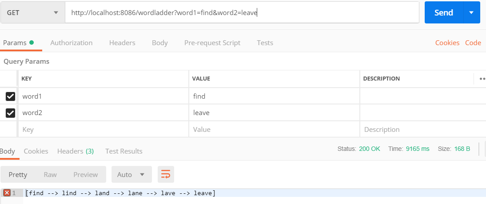
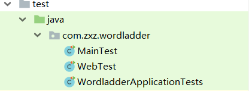

# worldladder 使用说明
## 1. 项目类型
&emsp;&emsp;Spring Initializr web项目
## 2. 运行
&emsp;&emsp;命令行进入项目根目录 `/wordladder`,
```
mvn spring-boot:run
```
&emsp;&emsp;或者直接在intellij中运行项目:

&emsp;&emsp; `wordladder\src\main\java\com\zxz\wordladder\WordladderApplication.java`
## 3. 使用方法
&emsp;&emsp;在Postman中发送请求，使用get方法，需要两个参数，端口为8086。示例：
```http
http://localhost:8086/wordladder?word1=find&word2=leave
```
&emsp;&emsp;在Postman中显示wordladder string数组。示例：
```
[find, lind, land, lane, lave, leave]
```


## 4. test
* service层功能测试 `MainTest`
* web层功能测试 `WebTest`



&emsp;&emsp;测试结果：


