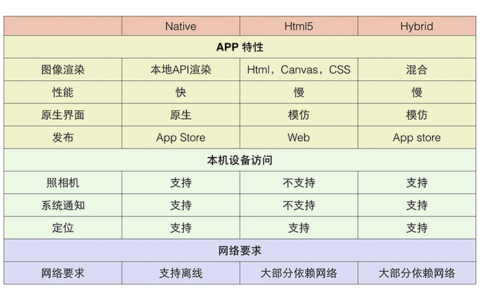

# Web App、Native App and Hybrid app
周雪振 5141509091 &emsp;2018/10/28

---

## App的分类
* native app
* web app
* hybrid app

&emsp;&emsp;他们之间的关系可以用下图表示：  
&emsp;&emsp;

> &emsp;&emsp;Web App 指采用Html5语言写出的App，不需要下载安装。类似于现在所说的轻应用。生存在浏览器中的应用，基本上可以说是触屏版的网页应用。  

&emsp;&emsp;例如下图左，浏览器中的众多小图标就是一个个的Web App。  
&emsp;&emsp;&emsp;

>&emsp;&emsp;Native APP 指的是原生程序，一般依托于操作系统，有很强的交互，是一个完整的App，可拓展性强。  

&emsp;&emsp;例如上图右中的桌面软件。

>&emsp;&emsp;中文名称是“混合app”。顾名思义，就是 native app 与 web app的混合。在native app里内置浏览器，合适的功能页面采用网页的形式呈现。比如京东的某些营销页面，今日头条的某些新闻页面、微信的腾讯新闻的内容页面等。

## Web App、Native App、Hybrid App之间的对比
### &emsp;Web App
* 优点
  - 开发和维护成本低 
  - 跨平台终端
  - 无需安装成本 
  - 基于浏览器，可以跨平台使用
  - 任何时候都可以发布App，因为根本不需要官方的审核
* 缺点
  - 调用本地文件系统的能力弱
  - 无法使用很多移动硬件设备的独特功能
  - 依赖于网络,页面访问速度慢,耗费流量 
  - 设计受限制诸多
  - 体验较差

### &emsp;Native App
* 优点
  - 可访问本地资源
  - 可节省带宽成本
  - 直接依托于操作系统,交互性最强,性能最好 
  - 针对不同平台提供不同体验
  - 为用户提供最佳的体验，最优质的界面和最华丽的交互
  - 应用审核流程会保证让用户得到高质量以及安全的App
  - 操作速度快，上手流畅
  - 性能稳定
  - 用户留存率高
* 缺点
  - 盈利需要与第三方分成
  - 维护成本高（例如一款App已更新至V5版本，但仍有用户在使用V2， V3， V4版本，需要更多的开发人员维护之前的版本）
  - 无法跨平台,不同平台Android和iOS上都要各自独立开发（Android上基于Java开发,iOS上基于OC或Swift开发,相互之间独立,必须要有各自的开发人员） 
  - 发布到应用商店需要审核，流程复杂且慢，会严重影响你的发布进程
  - 更新缓慢，根据不同平台，提交–审核–上线 等等不同的流程，需要经过的流程较复杂

### &emsp;Hybrid App
* 优点
  - 开发成本较低,可以跨平台,调试方便 
  - 维护成本低,功能可复用 
  - 更新较为自由 
  - 功能更加完善,性能和体验要比起web app好太多 
  - 部分性能要求的页面可用原生实现 
* 缺点
  - 相比原生,性能仍然有较大损耗 
  - 不适用于交互性较强的app   

&emsp;&emsp;这种模式的主要应用是:一些新闻阅读类,信息展示类的app;但是不适用于一些交互较强或者性能要求较高的app(比如动画较多就不适合)  
&emsp;&emsp;Web App、Hybrid App and Native APP技术特性对比：  
&emsp;&emsp;

## React Native App
>Facebook发起的开源的一套新的APP开发方案,Facebook在当初深入研究Hybrid开发后,觉得这种模式有先天的缺陷,所以果断放弃,转而自行研究,后来推出了自己的“React Native”方案,不同于H5,也不同于原生,更像是用JS写出原生应用。

&emsp;优点：  
* 开发成本大于Hybrid模式,但是小于原生模式,大部分代码可复用 
* 性能体验高于Hybrid,不逊色与原生 
* 开发人员单一技术栈,一次学习,跨平台开发 
* 社区繁荣,遇到问题容易解决   

&emsp;缺点：  
* 虽然可以部分跨平台,但并不是Hybrid中的一次编写,两次运行那种,而是不同平台代码有所区别 
* 开发人员学习有一定成本 

## 各种开发模式的对比
| | Native App| Web App | Hybrid App | React Native App |
|-|-|-|-|-|
|原生功能体验|优秀|差|良好|接近优秀|
|渲染性能|非常快|慢|接近块|快|
|是否支持设备底层访问|支持|不支持|支持|支持|
|网络要求|支持离线|依赖网络|支持离线(资源存本地时)|支持离线|
|更新复杂度|高|低(服务器端直接更新)|较低|较低|
|编程语言|Android(Java),ios(OC/Swift)|js+html+css3|js+html+css3|主要使用js编写，语法jsx|
|社区资源|丰富(Android,iOS单独学习)|丰富(大量前端资源)|有局限(不同的Hybrid相互独立)|丰富(统一的活跃社区)|
|上手难度|难(不同平台需要单独学习)|简单(写一次,支持不同平台访问)|简单(写一次,运行任何平台)|中等(学习一次,写任何平台)|
|开发周期|长|短|较短|中等|
|开发成本|昂贵|便宜|较为便宜|中等|
|平台|不跨平台|所有H5浏览器|Android,iOS,h5浏览器|Android,iOS|
|APP发布|App Store|Web服务器|App Store|App Store|

## 如何选择开发模式
&emsp;&emsp;**选择纯Native App模式的情况**  
* 性能要求极高,体验要求极好,不追求开发效率   

&emsp;&emsp;一般属于吹毛求疵的那种级别了,因为正常来说如果要求不是特别高,会有Hybrid  

&emsp;&emsp;**选择Web App模式的情况**  
* 不追求用户体验和性能,对离线访问没要求 
* 没有额外功能,只有一些信息展示  

&emsp;&emsp;**选择Hybrid App模式的情况**  
* 大部分情况下的App都推荐采用这种模式   

&emsp;&emsp;这种模式可以用原生来实现要求高的界面,对于一些比较通用型,展示型的页面完全可以用web来实现,达到跨平台效果,提升效率

&emsp;&emsp;**选择React Native App模式的情况**  
* 追求性能,体验,同时追求开发效率,而且有一定的技术资本,舍得前期投入   

&emsp;&emsp;React Native这种模式学习成本较高,所以需要前期投入不少时间才能达到较好水平,但是有了一定水准后,开发起来它的优势就体现出来了,性能不逊色原生,而且开发速度也很快

>## 其他的app开发方案
>例如：**微信小程序** 是微信新推出的一种新的app方案,2016年9月开始进行内测,2016年11月准备全面面向开发者
需要注意的是,这种模式是“反HTML5”的,相当于是微信提供的一套封闭开发模式,有自己的语法和IDE,有的类似于iOS开发的感觉。

