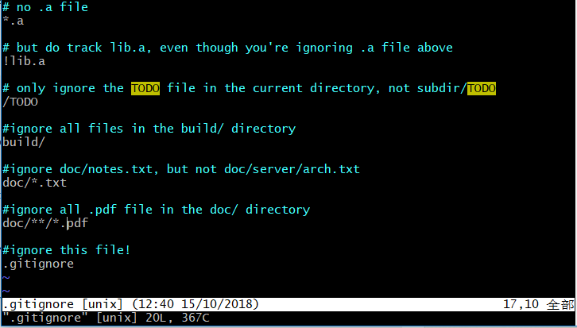

# <font color=red> Git零基础学习 </font>
2018年10月13日 &emsp;周雪振

---


<br />

---
## 什么是Git
&emsp;&emsp;[Git菜鸟教程](http://www.runoob.com/git/git-tutorial.html)关于git的开言这样介绍：
> Git是一个开源的分布式版本控制系统，用于敏捷高效地处理任何或小或大的项目。<br/>
>Git 是 Linus Torvalds 为了帮助管理 Linux 内核开发而开发的一个开放源码的版本控制软件。
>Git 与常用的版本控制工具 CVS, Subversion 等不同，它采用了分布式版本库的方式，不必服务器端软件支持。

&emsp;&emsp;学习Git的第一个疑问就是什么叫做**分布式版本控制系统**，网上有很多关于分布式版本控制系统的文章，他们的说法大多相似，可以参考，如果还不懂什么叫分布式版本控制系统，只有在亲身体验了Git和svn等不同的版本控制系统后，才会对这个概念产生比较直观的体验！<br />
&emsp;&emsp;[分布式和集中式版本控制的区别](https://blog.csdn.net/zhangqun23/article/details/52972261)<br />
&emsp;&emsp;[集中式版本控制与分布式版本控制的区别](https://www.jianshu.com/p/302932e65bbb)<br />
&emsp;&emsp;[何为集中式版本控制系统与分布式版本控制系统?](https://blog.csdn.net/gggg_ggg/article/details/49981617)<br />

---
&emsp;&emsp;
## <font color=gray> Git配置
&emsp;&emsp;**！！！这部分可以说跟一般使用者没什么关系，可以完全忽略不去了解！！！**<br /><br />
&emsp;&emsp;Git提供了叫做git config的工具，专门用来配置或读取相应的环境变量，而这些变量，据顶了Git在各个环节的具体工作方式和行为。这些变量可以存储在三个不同的地方：
* /etc/gitconfig文件：系统对所有用户都普遍使用的配置。执行<code>git congig --system</code>读写的就是这个文件。
* ~/.gitconfig文件：用户目录下的配置文件只适用于该用户。执行<code>git config --global</code>读写的就是这个文件。
* 当前项目的Git目录中的配置文件(也就是工作目录中的.git/config文件):这里的配置仅仅针对当前项目有效。<br />

&emsp;&emsp;**每一个级别的配置都会覆盖上层的相同配置，所以 .git/config 里的配置会覆盖 /etc/gitconfig 中的同名变量。**<br />
&emsp;&emsp;**如果使用了--global选项，那么更改的配置文件就是位于你用户主目录下的那个，以后你所有的项目都会默认使用这里配置的用户信息。**<br />
&emsp;&emsp;如果在某个特定的项目中使用其他名字或邮件，只要去掉--global选项重新配置即可，新的设定保存在当前项目的.git/config文件中。<br />
&emsp;&emsp;例如：
* 查看和修改用户名和用户邮箱：
```
$ git config --global user.name               //查看用户名
$ git config --global user.name xiaxiao       //修改用户名
$ git config --global user.email              //查看用户邮箱
$ git config --global user.email xxx@qq.com   //修改用户邮箱
```
* 修改Git的文本编辑器，一般默认为Vim，可以使用下面的命令修改Git的编辑器：
```
$ git config --global core.editor vim
```
* 设置解决合并冲突时使用的差异分析工具，比如设置为vimdiff
```
$ git config --global merge.tool vimdiff
```
* 查看已有的配置信息，有时会看到重复的变量名，说明他们是来自不同的配置文件。
```
$ git config --list
```
* 也可以直接查看某个环境变量的设定：
```
$ git config user.name
```
</font>

---
## Git工作区、暂存区、版本库
> * **工作区:** 就是你在电脑里能够看到的目录。
> * **暂存区:** 英文叫做stage，或index。一般存放在".git/index"文件中。
> * **版本库:** 工作区有一个隐藏的目录.git，这个不算工作区，二是Git的版本库。

&emsp;&emsp;三者之间的关系为：<br />


---
## Git创建仓库
### **git init** <br />
&emsp;&emsp;Git使用<code>git init</code>命令来初始化一个Git仓库。执行此命令后，Git仓库会在根目录生成一个.git目录，该目录包含了资源的所有元数据，其他项目的目录保持不变。<br />
&emsp;&emsp;使用方法：<br />
&emsp;&emsp;想使用某个目录作为仓库，我们只需要在那个目录下使它初始化。
```
$ cd myrepo
$ git init
```
&emsp;&emsp;myrepo是一个目录，比如d:/myfile/myrepo。<br />
&emsp;&emsp;我们也可以制定目录作为Git仓库：
```
git init newrepo
```
&emsp;&emsp;初始化后，会在myrepo或newrepo目录下会出现一个名为 .git 的目录，所有 Git 需要的数据和资源都存放在这个目录中。<br />
### **git clone**
&emsp;&emsp;我们可以使用<code>git clone</code>从现有的Git仓库中拷贝项目，格式为：
```
git clone <repo>
```
如果需要克隆到指定的目录，可以使用下面的命令格式：
```
git clone <repo> <directory>
```
&emsp;&emsp;repo:Git仓库。 <br />
&emsp;&emsp;directory:本地仓库。<br />

---
## 文件操作
### **文件状态**

&emsp;&emsp;工作目录下的每一个文件都不外乎这两种状态：已跟踪或未跟踪。 已跟踪的文件是指那些被纳入了版本控制的文件，在上一次快照中有它们的记录，在工作一段时间后，它们的状态可能处于未修改，已修改或已放入暂存区。 工作目录中除已跟踪文件以外的所有其它文件都属于未跟踪文件，它们既不存在于上次快照的记录中，也没有放入暂存区。 <br />
&emsp;&emsp;编辑过某些文件之后，由于自上次提交后你对它们做了修改，Git 将它们标记为已修改文件。 我们逐步将这些修改过的文件放入暂存区(add)，然后提交所有暂存了的修改(commit)，如此反复。所以使用 Git 时文件的生命周期如上图所示。  

### **跟踪和提交文件**
&emsp;&emsp;使用<code>git add</code>进行文件的跟踪，使用<code>git commit -m '描述信息'</code>进行文件的提交。<br />
&emsp;&emsp;比如创建一个文件之后(test.cpp)，我们需要执行这样的命令跟踪文件：
```
git add test.cpp
```
&emsp;&emsp;执行这样的命令提交文件到版本库：
```
git commit -m 'first commit'
```
&emsp;&emsp;如果我们修改了已经跟踪的文件，我们需要重新执行add和commit指令，完成版本库里文件的更新。如果像跳过add指令，可以这样操作：
```
$ git commit -a -m 'add new message'
```  
### **检查当前文件状态**
&emsp;&emsp;可以使用<code>git status</code>指令检查文件状态。
```
$ git status
```
&emsp;&emsp;文件状态不同会输出不同的结果：
&emsp;&emsp;<code>directory clean</code>这说明你的工作目录很干净，所有已跟踪的的文件自从上次提交后未被更改过，而且目录中没有任何未被跟踪的文件。可以这样理解：工作区和暂存区都没有需要操作的文件。
```
$ git status
On branch master
nothing to commit, working directory clean
```
&emsp;&emsp;<code>Untracked filed</code>说明README文件还没有被跟踪，也就是之前的快照中没有这个文件(add 指令可以跟踪这个文件)。
```
$ git status
On branch master
Untracked files:
  (use "git add <file>..." to include in what will be committed)

    README

nothing added to commit but untracked files present (use "git add" to track)
```
&emsp;&emsp;<code>changes to be committed</code>说明README已经被跟踪了，但是还没有提交到版本库。
```
$ git status
On branch master
Changes to be committed:
  (use "git reset HEAD <file>..." to unstage)

    new file:   README
```
&emsp;&emsp;<code>changes not staged for commit</code>说明CONTRIBUTING.md文件已经被修改了，还没放到暂存区(也就是还没被重新跟踪)。  
```
$ git staus
Changes not staged for commit:
  (use "git add <file>..." to update what will be committed)
  (use "git checkout -- <file>..." to discard changes in working directory)

    modified:   CONTRIBUTING.md
```
&emsp;&emsp;**状态简览：**
* <code>??</code>：新添文件未跟踪；
* <code> M</code>：修改过的文件，但还没放到暂存区；
* <code>M </code>：修改过的文件，已经放进暂存区
* <code>MM</code>：修改过文件放入暂存区之后又被修改了，所以工作区和暂存区都有修改记录。
* <code>A </code>：新文件放入暂存区。
* <code>AM</code>：新文件放入暂存区之后，又被修改；  
```
$ git status -s
 M README
MM Rakefile
A  lib/git.rb
M  lib/simplegit.rb
?? LICENSE.txt
```

### **忽略文件**
&emsp;&emsp;一般我们总会有些文件无需纳入Git的管理，也不希望它们总出现在未跟踪文件列表。 通常都是些自动生成的文件，比如日志文件，或者编译过程中创建的临时文件等。 在这种情况下，我们可以创建一个名为 .gitignore 的文件，列出要忽略的文件模式。
&emsp;&emsp;.gitignore文件的格式规范如下：
* 所有空行或者以 ＃ 开头的行都会被 Git 忽略。
* 可以使用标准的 [glob](https://blog.csdn.net/nlznlz/article/details/76768907) 模式匹配。
* 匹配模式可以以（/）开头防止递归。
* 匹配模式可以以（/）结尾指定目录。
* 要忽略指定模式以外的文件或目录，可以在模式前加上惊叹号（!）取反。

&emsp;&emsp;所谓的 glob 模式是指 shell 所使用的简化了的正则表达式。 星号<code>\*</code>匹配零个或多个任意字符；[abc] 匹配任何一个列在方括号中的字符（这个例子要么匹配一个 a，要么匹配一个 b，要么匹配一个 c）；问号（?）只匹配一个任意字符；如果在方括号中使用短划线分隔两个字符，表示所有在这两个字符范围内的都可以匹配（比如 [0-9] 表示匹配所有 0 到 9 的数字）。 使用两个星号（*) 表示匹配任意中间目录，比如`a/**/z` 可以匹配 a/z, a/b/z 或 `a/b/c/z`等。
&emsp;&emsp;比如.gitignore文件可以这样写：


### **移除文件**
&emsp;&emsp;要从 Git 中移除某个文件，就必须要从已跟踪文件清单中移除（确切地说，是从暂存区域移除），然后提交。 可以用 git rm 命令完成此项工作，并连带从工作目录中删除指定的文件，这样以后就不会出现在未跟踪文件清单中了。
&emsp;&emsp;如果只是简单地从工作目录中手工删除文件，运行<code>git status</code>时就会在<code>Changes not staged for commit</code>部分（也就是 未暂存清单）看到：
```
$ rm PROJECTS.md
$ git status
On branch master
Your branch is up-to-date with 'origin/master'.
Changes not staged for commit:
  (use "git add/rm <file>..." to update what will be committed)
  (use "git checkout -- <file>..." to discard changes in working directory)

        deleted:    PROJECTS.md

no changes added to commit (use "git add" and/or "git commit -a")
```
&emsp;&emsp;还要再执行<code>git rm</code>指令，然后提交，该文件就不会再纳入版本库管理了。
```
$ git rm PROJECTS.md
rm 'PROJECTS.md'
$ git status
On branch master
Changes to be committed:
  (use "git reset HEAD <file>..." to unstage)

    deleted:    PROJECTS.md
```
&emsp;&emsp;<code>git rm</code>的几个参数模式：

&emsp;&emsp;如果删除之前修改过并且已经放到暂存区的话，需要使用强制删除选项<code>-f</code>。
```
git rm -f readme.txt
```
&emsp;&emsp;把文件从 Git 仓库中删除（亦即从暂存区域移除），但仍然希望保留在当前工作目录中。 换句话说，你想让文件保留在磁盘，但是并不想让 Git 继续跟踪。 当你忘记添加 .gitignore 文件，不小心把一个很大的日志文件或一堆 .a 这样的编译生成文件添加到暂存区时，需要使用<code>--cached</code>选项。 
```
$ git rm --cached README
```
&emsp;&emsp;git rm 命令后面可以列出文件或者目录的名字，也可以使用[glob](https://blog.csdn.net/nlznlz/article/details/76768907)模式。<code>log/</code>是目录，<code>\\</code>是Git自己的文件模式扩展匹配方式，<code>*.log</code>是glob模式，表示所有以.log结尾的文件。第二条指令表示删除所有以~结尾的文件。
```
$ git rm log/\*.log
$ git rm \*~
```
### **移动文件**
&emsp;&emsp;Git 并不显式跟踪文件移动操作。如果在Git中重命名了某个文件，仓库中存储的[元数据](https://baike.baidu.com/item/元数据/1946090?fr=aladdin)并不会体现出这是一次改名操作。改名操作可以是这样的：
```
$ git mv file_from file_to
```
&emsp;&emsp;此时查看状态信息，会显示未重命名。
```
$ git mv README.md README
$ git status
On branch master
Changes to be committed:
  (use "git reset HEAD <file>..." to unstage)

    renamed:    README.md -> README
```


---
