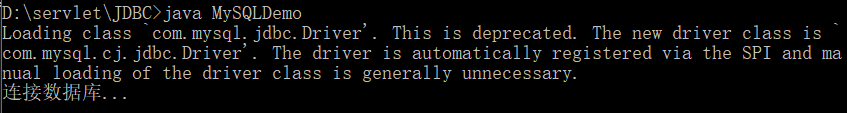
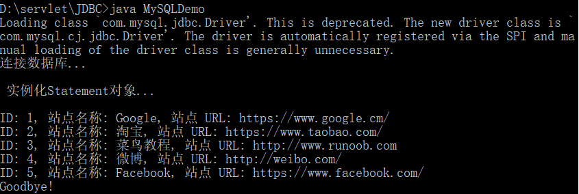
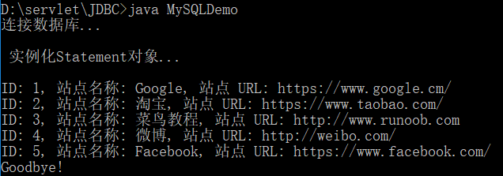

# JDBC 连接 MySQL Demo

&emsp;&emsp;Java 连接 MySQL 需要驱动包，最新版下载地址为：[http://dev.mysql.com/downloads/connector/j/](http://dev.mysql.com/downloads/connector/j/)，解压后得到jar库文件，然后在对应的项目中导入该库文件。

* 创建测试数据

&emsp;&emsp;在 MySQL 中创建 RUNOOB 数据库，并创建 websites 数据表，表结构如下：
```sql
CREATE TABLE `websites` (
  `id` int(11) NOT NULL AUTO_INCREMENT,
  `name` char(20) NOT NULL DEFAULT '' COMMENT '站点名称',
  `url` varchar(255) NOT NULL DEFAULT '',
  `alexa` int(11) NOT NULL DEFAULT '0' COMMENT 'Alexa 排名',
  `country` char(10) NOT NULL DEFAULT '' COMMENT '国家',
  PRIMARY KEY (`id`)
) ENGINE=InnoDB AUTO_INCREMENT=10 DEFAULT CHARSET=utf8;
```
&emsp;&emsp;插入一些数据
```sql
INSERT INTO `websites` 
VALUES ('1', 'Google', 'https://www.google.cm/', '1', 'USA'), 
       ('2', '淘宝', 'https://www.taobao.com/', '13', 'CN'), 
       ('3', '菜鸟教程', 'http://www.runoob.com', '5892', ''), 
       ('4', '微博', 'http://weibo.com/', '20', 'CN'), 
       ('5', 'Facebook', 'https://www.facebook.com/', '3', 'USA');
```

* 连接数据库

&emsp;&emsp;以下实例使用了 JDBC 连接 MySQL 数据库，注意一些数据如用户名，密码需要根据你的开发环境来配置：
```java

import java.sql.*;
 
public class MySQLDemo {
 
    // JDBC 驱动名及数据库 URL
    static final String JDBC_DRIVER = "com.mysql.jdbc.Driver";  
    static final String DB_URL = "jdbc:mysql://localhost:3306/runoob?useSSL=false&serverTimezone=GMT";
 
    // 数据库的用户名与密码，需要根据自己的设置
    static final String USER = "root";
    static final String PASS = "123456";
 
    public static void main(String[] args) {
        Connection conn = null;
        Statement stmt = null;
        try{
            // 注册 JDBC 驱动
            /* 
             * 修改之后：
             * Class.forName("com.mysql.cj.jdbc.Driver");
             */
            Class.forName("com.mysql.jdbc.Driver");
        
            // 打开链接
            System.out.println("连接数据库...\n");
            conn = DriverManager.getConnection(DB_URL,USER,PASS);
        
            // 执行查询
            System.out.println(" 实例化Statement对象...\n");
            stmt = conn.createStatement();
            String sql;
            sql = "SELECT id, name, url FROM websites";
            ResultSet rs = stmt.executeQuery(sql);
        
            // 展开结果集数据库
            while(rs.next()){
                // 通过字段检索
                int id  = rs.getInt("id");
                String name = rs.getString("name");
                String url = rs.getString("url");
    
                // 输出数据
                System.out.print("ID: " + id);
                System.out.print(", 站点名称: " + name);
                System.out.print(", 站点 URL: " + url);
                System.out.print("\n");
            }
            // 完成后关闭
            rs.close();
            stmt.close();
            conn.close();
        }catch(SQLException se){
            // 处理 JDBC 错误
            se.printStackTrace();
        }catch(Exception e){
            // 处理 Class.forName 错误
            e.printStackTrace();
        }finally{
            // 关闭资源
            try{
                if(stmt!=null) stmt.close();
            }catch(SQLException se2){
            }// 什么都不做
            try{
                if(conn!=null) conn.close();
            }catch(SQLException se){
                se.printStackTrace();
            }
        }
        System.out.println("Goodbye!");
    }
}
```

* 备注

&emsp;&emsp; MySQL 8.0 以上版本: 

&emsp;&emsp;驱动包版本 mysql-connector-java-8.0.12.jar。
 
&emsp;&emsp;数据库 URL 需要声明是否使用 SSL 安全验证及指定服务器上的时区：
 ```java
 String DB_URL = "jdbc:mysql://localhost:3306/runoob?useSSL=false&serverTimezone=UTC";
 conn = DriverManager.getConnection(DB_URL,USER,PASS);
 ```
 &emsp;&emsp;原本的驱动器是:
 ```java
Class.forName("com.mysql.jdbc.Driver");
 ```
 &emsp;&emsp;在命令行里提示：

 

 &emsp;&emsp;意思是说原本的驱动器不赞成 或者 是废弃了，自动换成了新的驱动器 `com.mysql.cj.jdbc.Driver`。只要把驱动器加载语句改成这样就不会提示这个信息了：
 ```java
 Class.forName("com.mysql.cj.jdbc.Driver");
 ```
 

* 编译MySQLDemo运行结果如下:



&emsp;&emsp;修改驱动器加载语句之后的运行结果：

