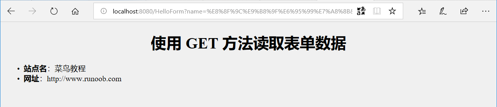
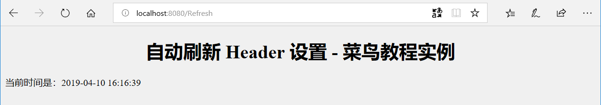

# servlet

* [1. Servlet 是什么](#1)
* [2. Servlet 的优点](#2)
* [3. Servlet 环境设置](#3)
* [4. Servlet 生命周期](#4)
  * [4-1. servlet 生命周期过程](#4-1)
  * [4-2. init()](#4-2)
  * [4-3. service()](#4-3)
  * [4-4. doGet()](#4-4)
  * [4-5. doPost()](#4-5)
  * [4-6. destroy()](#4-6)
* [5. Servlet 生命周期方案](#5)
* [6. Servlet 第一个servlet](#6)
* [7. Servlet 表单数据](#7)
* [8. Servlet 处理表单数据实例](#8)
  * [8-1. 使用 URL 的 GET 方法实例](#8-1)
  * [8-2. 使用表单的 GET 方法实例](#8-2)
  * [8-3. 使用表单的 POST 方法实例](#8-3)
  * [8-4. 将复选框数据传递到 Servlet 程序](#8-4)
  * [8-5. 读取所有的表单参数](#8-5)
* [9. Servlet 客户端 HTTP 请求](#9)
  * [9-1. 来自浏览器端的头信息](#9-1)
  * [9-2. 读取 HTTP 头的方法](#9-2)
  * [9-3. Header 请求实例](#9-3)
* [10. Servlet 服务器 HTTP 响应](#10)
  * [10-1. 响应内容](#10-1)
  * [10-2. 设置 HTTP 响应报头的方法](#10-2)
  * [10-3. HTTP Header实例](#10-3)
* [11. Servlet HTTP 状态码](#11)
  * [11-1. 状态码](#11-1)
  * [11-2. 设置 HTTP 状态代码的方法](#11-2)
  * [11-3. HTTP 状态码实例](#11-3)
* [12. Servlet 编写过滤器](#12)
  * [12-1. 过滤器简介](#12-1)
  * [12-2. 过滤器方法](#12-2)
  * [12-3. FilterConfig 使用](#12-3)
  * [12-4. Servlet 过滤器实例](#12-4)
  * [12-5. 使用多个过滤器](#12-5)
  * [12-6. 过滤器 web.xml 配置各节点说明](#12-6)
* [13. Servlet 异常处理](#13)
  * [13. web.xml 配置](#13-1)
  * [13. 请求属性-错误/异常](#13-2)
  * [13. Servlet 错误处理程序实例](#13-3)
* [14. Servlet Cookie 处理](#14)
  * [14-1. Cookie 剖析](#14-1)
  * [14-2. Servlet Cookie 方法](#14-2)
  * [14-3. 通过 Servlet 设置 Cookie](#14-3)
  * [14-4. 通过 Servlet 读取 Cookie](#14-4)
  * [14-5. 通过 Servlet 删除 Cookie](#14-5)
* [15. Servlet Session 跟踪](#15)
* [16. Servlet 文件上传](#16)
* [17. Servlet 文件下载](#17)

<hr />

## 1. <span id="1"></span>`servlet`是什么
* `Java Servlet` 是运行在 Web 服务器或应用服务器上的程序，它是作为来自 Web 浏览器或其他 HTTP 客户端的请求和 HTTP 服务器上的数据库或应用程序之间的中间层。
* `Java Servlet` 是运行在带有支持` Java Servlet` 规范的解释器的 web 服务器上的 `Java` 类。
* `Servlet` 可以使用 `javax.servlet` 和 `javax.servlet.http` 包创建，它是 `Java` 企业版的标准组成部分，Java 企业版是支持大型开发项目的 `Java` 类库的扩展版本。
* `Servlet` 是服务 HTTP 请求并实现 `javax.servlet.Servlet` 接口的 `Java` 类。Web 应用程序开发人员通常编写 `Servlet` 来扩展 `javax.servlet.http.HttpServlet`，并实现 `Servlet` 接口的抽象类专门用来处理 HTTP 请求。

<hr />

## 2. <span id="2"></span>`servlet`的优点
* `Servlet` 在 Web 服务器的地址空间内执行。这样它就没有必要再创建一个单独的进程来处理每个客户端请求。
* `Servlet` 是独立于平台的，因为它们是用 `Java` 编写的。
* 服务器上的 `Java` 安全管理器执行了一系列限制，以保护服务器计算机上的资源。因此，`Servlet` 是可信的。

<hr />

## <span id="3"></span>3. `servlet` 环境设置
* 开发环境可以开发、测试、运行 `Servlet` 的地方。
* 就像任何其他的 `Java` 程序，您需要通过使用 `Java` 编译器 `javac` 编译 `Servlet`，在编译 `Servlet` 应用程序后，将它部署在配置的环境中以便测试和运行。
* `JDK`、web服务器(在市场上有许多 Web 服务器支持 `Servlet`。有些 Web 服务器是免费下载的，`Tomcat` 就是其中的一个)

<hr />

## <span id="4"></span>4. `servlet`生命周期
* <span id="4-1"></span>`Servlet` 生命周期可被定义为从创建直到毁灭的整个过程。以下是 `Servlet` 遵循的过程：

  * `Servlet` 通过调用 `init ()` 方法进行初始化。
  * `Servlet` 调用 `service()` 方法来处理客户端的请求。
  * `Servlet` 通过调用 `destroy()` 方法终止（结束）。
  * 最后，`Servlet` 是由 `JVM` 的垃圾回收器进行垃圾回收的。
* <span id="4-2"></span>`init()` 方法
  
  * `init` 方法被设计成只调用一次。它在第一次创建 `Servlet` 时被调用，在后续每次用户请求时不再调用。因此，它是用于一次性初始化，就像 `Applet` 的 `init` 方法一样。
  * `Servlet` 创建于用户第一次调用对应于该 `Servlet` 的 `URL` 时，但是也可以指定 `Servlet` 在服务器第一次启动时被加载。当用户调用一个 `Servlet` 时，就会创建一个 `Servlet` 实例，每一个用户请求都会产生一个新的线程，适当的时候移交给 `doGet` 或 `doPost` 方法。`init()` 方法简单地创建或加载一些数据，这些数据将被用于 `Servlet` 的整个生命周期。
  * `init` 方法的定义如下：
    ```java
    public void init() throws ServletException {
     // 初始化代码...
     }
    ```
* <span id="4-3"></span>`service()`方法
  * `service()` 方法是执行实际任务的主要方法。`Servlet` 容器（即 Web 服务器）调用 `service()` 方法来处理来自客户端（浏览器）的请求，并把格式化的响应写回给客户端。
  * 每次服务器接收到一个 `Servlet` 请求时，服务器会产生一个新的线程并调用服务。`service()` 方法检查 HTTP 请求类型（`GET`、`POST`、`PUT`、`DELETE` 等），并在适当的时候调用 `doGet`、`doPost`、`doPut`，`doDelete` 等方法。
  * 下面是该方法的特征：
    ```java
    public void service(ServletRequest request, 
                    ServletResponse response) 
      throws ServletException, IOException{
    }
    ```
  * `service()` 方法由容器调用，`service` 方法在适当的时候调用 `doGet`、`doPost`、`doPut`、`doDelete` 等方法。所以，您不用对 `service()` 方法做任何动作，您只需要根据来自客户端的请求类型来重写 `doGet()` 或 `doPost()` 即可。
* <span id="4-4"></span>`doGet()`方法
  * `GET` 请求来自于一个 URL 的正常请求，或者来自于一个未指定 `METHOD` 的 HTML 表单，它由 `doGet()` 方法处理。
    ```java
    public void doGet(HttpServletRequest request,
                  HttpServletResponse response)
    throws ServletException, IOException {
    // Servlet 代码
    }
    ```
* <span id="4-5"></span>`doPost()`方法
  * `POST` 请求来自于一个特别指定了 `METHOD` 为 `POST` 的 HTML 表单，它由 `doPost()` 方法处理。
    ```java
    public void doPost(HttpServletRequest request,
                   HttpServletResponse response)
    throws ServletException, IOException {
    // Servlet 代码
    }
    ```
* <span id="4-6"></span>`destory()`方法
  * `destroy()` 方法只会被调用一次，在 `Servlet` 生命周期结束时被调用。`destroy()` 方法可以让您的 `Servlet` 关闭数据库连接、停止后台线程、把 `Cookie` 列表或点击计数器写入到磁盘，并执行其他类似的清理活动。
  * 在调用 `destroy()` 方法之后，`servlet` 对象被标记为垃圾回收。`destroy` 方法定义如下所示：
    ```java
    public void destroy() {
    // 终止化代码...
    }
    ```

<hr />

## <span id="5"></span>5. `servlet`生命周期方案
* 第一个到达服务器的 HTTP 请求被委派到 Servlet 容器。
* Servlet 容器在调用 service() 方法之前加载 Servlet。
* 然后 Servlet 容器处理由多个线程产生的多个请求，每个线程执行一个单一的 Servlet 实例的 service() 方法

  

<hr />

## <span id="6"></span>6. 第一个`servlet`
* `Hello World` ！

&emsp;&emsp;下面是 Servlet 输出 Hello World 的示例源代码：(copy代码的时候要把注释去掉，java可能不支持`//`注释)
```java
// 导入必需的 java 库
import java.io.*;
import javax.servlet.*;
import javax.servlet.http.*;

// 扩展 HttpServlet 类
public class HelloWorld extends HttpServlet {
 
  private String message;

  public void init() throws ServletException
  {
      // 执行必需的初始化
      message = "Hello World";
      System.out.println("init: "+message);
  }

  public void doGet(HttpServletRequest request,
                    HttpServletResponse response)
            throws ServletException, IOException
  {
      // 设置响应内容类型
      response.setContentType("text/html");

      // 实际的逻辑是在这里
      PrintWriter out = response.getWriter();
      out.println("<h1>" + message + "</h1>");
  }
  
  public void destroy()
  {
      // 什么也不做
      System.out.println("destroy: "+message);
  }
}
```

* 编译`servlet`

&emsp;&emsp;如果 `Servlet` 依赖于任何其他库，您必须在 `CLASSPATH` 中包含那些 JAR 文件。在这只包含了 `servlet-api.jar` JAR 文件，不是java标准的库，可以去maven的仓库里下载。
```
$ javac HelloWorld.java
```

* `servlet` 部署

&emsp;&emsp;默认情况下，`Servlet` 应用程序位于路径 `<Tomcat-installation-directory>/webapps/ROOT` 下，且类文件放在 `<Tomcat-installation-directory>/webapps/ROOT/WEB-INF/classes` 中。

&emsp;&emsp;现在，让我们把 `HelloWorld.class` 复制到 `<Tomcat-installation-directory>/webapps/ROOT/WEB-INF/classes` 中，并在位于 `<Tomcat-installation-directory>/webapps/ROOT/WEB-INF/ `的 `web.xml` 文件中创建以下条目：
```xml
<web-app>      
    <servlet>
        <servlet-name>HelloWorld</servlet-name>
        <servlet-class>HelloWorld</servlet-class>
    </servlet>

    <servlet-mapping>
        <servlet-name>HelloWorld</servlet-name>
        <url-pattern>/HelloWorld</url-pattern>
    </servlet-mapping>
</web-app>  
```
&emsp;&emsp;上面的条目要被创建在 `web.xml` 文件中的 `<web-app>`...`</web-app>` 标签内。在该文件中可能已经有各种可用的条目，但不要在意。
* `servlet` 运行

&emsp;&emsp;到这里，基本上已经完成了，使用 `<Tomcat-installation-directory>\bin\startup.bat`（在 Windows 上）或 `<Tomcat-installation-directory>/bin/startup.sh（在 Linux/Solaris` 等上）启动 `tomcat` 服务器，最后在浏览器的地址栏中输入 `http://localhost:8080/HelloWorld`。如果一切顺利，您会看到下面的结果：

  
  > 要配置`JDK`的`JAVA_HOME`的环境变量，不然tomcat可能会闪退

<hr />

## <span id="7"></span>7. `servlet` 表单数据
&emsp;&emsp;很多情况下，需要传递一些信息，从浏览器到 Web 服务器，最终到后台程序。浏览器使用两种方法可将这些信息传递到 Web 服务器，分别为 `GET` 方法和 `POST` 方法。

* `GET` 方法

&emsp;&emsp;`GET` 方法向页面请求发送已编码的用户信息。页面和已编码的信息中间用 ? 字符分隔，如下所示：
```
http://www.test.com/hello?key1=value1&key2=value2
```
&emsp;&emsp;`GET` 方法是默认的从浏览器向 Web 服务器传递信息的方法，它会产生一个很长的字符串，出现在浏览器的地址栏中。如果您要向服务器传递的是密码或其他的敏感信息，请不要使用 `GET` 方法。`GET` 方法有大小限制：请求字符串中最多只能有 `1024` 个字符。

&emsp;&emsp;这些信息使用 `QUERY_STRING` 头传递，并可以通过 `QUERY_STRING` 环境变量访问，`Servlet` 使用 `doGet()` 方法处理这种类型的请求。

* `POST` 方法
&emsp;&emsp;另一个向后台程序传递信息的比较可靠的方法是 `POST` 方法。`POST` 方法打包信息的方式与 `GET` 方法基本相同，但是 `POST` 方法不是把信息作为 URL 中 ? 字符后的文本字符串进行发送，而是把这些信息作为一个单独的消息。消息以标准输出的形式传到后台程序，您可以解析和使用这些标准输出。`Servlet` 使用 `doPost()` 方法处理这种类型的请求。

* 使用`servlet` 读取表单数据
&emsp;&emsp;Servlet 处理表单数据，这些数据会根据不同的情况使用不同的方法自动解析：
  * getParameter()：您可以调用 request.getParameter() 方法来获取表单参数的值。
  * getParameterValues()：如果参数出现一次以上，则调用该方法，并返回多个值，例如复选框。
  * getParameterNames()：如果您想要得到当前请求中的所有参数的完整列表，则调用该方法。

<hr />

## <span id="8"></span>8. `servlet` 处理表单数据实例
* <span id="8-1"></span>使用 URL 的 `GET` 方法实例

&emsp;&emsp;下面是一个简单的 URL，将使用 GET 方法向 HelloForm 程序传递两个值。
  ```
  http://localhost:8080/TomcatTest/HelloForm?name=菜鸟教程&url=www.runoob.com
  ```
&emsp;&emsp;下面是处理 Web 浏览器输入的 `HelloForm.java Servlet` 程序。我们将使用 `getParameter()` 方法，可以很容易地访问传递的信息：
  ```java
  package com.runoob.test;

  import java.io.IOException;
  import java.io.PrintWriter;

  import javax.servlet.ServletException;
  import javax.servlet.annotation.WebServlet;
  import javax.servlet.http.HttpServlet;
  import javax.servlet.http.HttpServletRequest;
  import javax.servlet.http.HttpServletResponse;

  /**
   * Servlet implementation class HelloForm
   */
  @WebServlet("/HelloForm")
  public class HelloForm extends HttpServlet {
      private static final long serialVersionUID = 1L;
       
      /**
       * @see HttpServlet#HttpServlet()
       */
      public HelloForm() {
          super();
          // TODO Auto-generated constructor stub
      }

      /**
       * @see HttpServlet#doGet(HttpServletRequest request, HttpServletResponse response)
      */
      protected void doGet(HttpServletRequest request, HttpServletResponse response) throws ServletException, IOException {
        // 设置响应内容类型
          response.setContentType("text/html;charset=UTF-8");

          PrintWriter out = response.getWriter();
          String title = "使用 GET 方法读取表单数据";
        // 处理中文
          String name =new String(request.getParameter("name").getBytes("ISO8859-1"),"UTF-8");
          String docType = "<!DOCTYPE html> \n";
          out.println(docType +
            "<html>\n" +
            "<head><title>" + title + "</title></head>\n" +
            "<body bgcolor=\"#f0f0f0\">\n" +
            "<h1 align=\"center\">" + title + "</h1>\n" +
            "<ul>\n" +
            "  <li><b>站点名</b>："
            + name + "\n" +
            "  <li><b>网址</b>："
            + request.getParameter("url") + "\n" +
            "</ul>\n" +
            "</body></html>");
      }
    
      // 处理 POST 方法请求的方法
      public void doPost(HttpServletRequest request, HttpServletResponse response) throws ServletException, IOException {
          doGet(request, response);
      }
  }
  ```
  &emsp;&emsp;然后在 web.xml 文件中创建以下条目：
  ```xml
<web-app>
  <servlet>
    <servlet-name>HelloForm</servlet-name>
    <servlet-class>com.runoob.test.HelloForm</servlet-class>
  </servlet>
  <servlet-mapping>
    <servlet-name>HelloForm</servlet-name>
    <url-pattern>/TomcatTest/HelloForm</url-pattern>
  </servlet-mapping>
</web-app>
  ```
&emsp;&emsp;现在在浏览器的地址栏中输入 `http://localhost:8080/TomcatTest/HelloForm?name=菜鸟教程&url=www.runoob.com` ，并在触发上述命令之前确保已经启动 Tomcat 服务器。如果一切顺利，会得到下面的结果：

  

* <span id="8-2"></span>使用表单的 `GET` 方法实例

&emsp;&emsp;下面是一个简单的实例(index.jsp)，使用 HTML 表单和提交按钮传递两个值。将使用相同的 `Servlet` `HelloForm` 来处理输入。
```html
<%@ page language="java" import="java.util.*" pageEncoding="utf-8"%> 
<!DOCTYPE html>
<html>
<head>
<meta charset="utf-8">
<title>菜鸟教程(runoob.com)</title>
</head>
<body>
<form action="HelloForm" method="GET">
网址名：<input type="text" name="name">
<br />
网址：<input type="text" name="url" />
<input type="submit" value="提交" />
</form>
</body>
</html>
```
&emsp;&emsp;(这里都把jsp以及servlet文件放到了tomcat的安装目录下的webapps文件夹下面了)尝试输入网址名和网址，然后点击"提交"按钮，Gif 演示如下：




* <span id="8-3"></span>使用表单的 `POST` 方法实例

&emsp;&emsp;对上面的 Servlet 做小小的修改，以便它可以处理 GET 和 POST 方法。下面的 HelloForm.java Servlet 程序使用 GET 和 POST 方法处理由 Web 浏览器给出的输入。

> `String name =new String(request.getParameter("name").getBytes("ISO8859-1"),"UTF-8");`
```java
package com.runoob.test;

import java.io.IOException;
import java.io.PrintWriter;

import javax.servlet.ServletException;
import javax.servlet.annotation.WebServlet;
import javax.servlet.http.HttpServlet;
import javax.servlet.http.HttpServletRequest;
import javax.servlet.http.HttpServletResponse;

/**
 * Servlet implementation class HelloForm
 */
@WebServlet("/HelloFormPOST")
public class HelloFormPOST extends HttpServlet {
    private static final long serialVersionUID = 1L;
       
    /**
     * @see HttpServlet#HttpServlet()
     */
    public HelloFormPOST() {
        super();
        // TODO Auto-generated constructor stub
    }

    /**
     * @see HttpServlet#doGet(HttpServletRequest request, HttpServletResponse response)
     */
    protected void doGet(HttpServletRequest request, HttpServletResponse response) throws ServletException, IOException {
        // 设置响应内容类型
        response.setContentType("text/html;charset=UTF-8");

        PrintWriter out = response.getWriter();
        String title = "使用 POST 方法读取表单数据";
        // 处理中文
        String name =new String(request.getParameter("name").getBytes("ISO8859-1"),"UTF-8");
        String docType = "<!DOCTYPE html> \n";
        out.println(docType +
            "<html>\n" +
            "<head><title>" + title + "</title></head>\n" +
            "<body bgcolor=\"#f0f0f0\">\n" +
            "<h1 align=\"center\">" + title + "</h1>\n" +
            "<ul>\n" +
            "  <li><b>站点名</b>："
            + name + "\n" +
            "  <li><b>网址</b>："
            + request.getParameter("url") + "\n" +
            "</ul>\n" +
            "</body></html>");
    }
    
    // 处理 POST 方法请求的方法
    public void doPost(HttpServletRequest request, HttpServletResponse response) throws ServletException, IOException {
        doGet(request, response);
    }
}
```
&emsp;&emsp;现在，编译部署上述的 Servlet，并使用带有 `POST` 方法的 `index.jsp` 进行测试，如下所示：
```html
<%@ page language="java" import="java.util.*" pageEncoding="utf-8"%> 
<!DOCTYPE html>
<html>
<head>
<meta charset="utf-8">
<title>菜鸟教程(runoob.com)</title>
</head>
<body>
<form action="HelloFormPOST" method="POST">
网址名：<input type="text" name="name">
<br />
网址：<input type="text" name="url" />
<input type="submit" value="提交" />
</form>
</body>
</html>
```
&emsp;&emsp;在`web.xml`中添加条目：
```xml
<servlet>
    <servlet-name>HelloFormPOST</servlet-name>
    <servlet-class>com.runoob.test.HelloFormPOST</servlet-class>
  </servlet>
  <servlet-mapping>
    <servlet-name>HelloFormPOST</servlet-name>
    <url-pattern>/HelloFormPOST</url-pattern>
  </servlet-mapping>
```
&emsp;&emsp;测试结果为：


* <span id="8-4"></span>将复选框数据传递到 Servlet 程序

&emsp;&emsp;当需要选择一个以上的选项时，则使用复选框。
下面是一个 jsp 代码实例，一个带有两个复选框的表单。
```html
<%@ page language="java" import="java.util.*" pageEncoding="utf-8"%> 
<!DOCTYPE html>
<html>
<head>
<meta charset="utf-8">
<title>菜鸟教程(runoob.com)</title>
</head>
<body>
<form action="CheckBox" method="POST" target="_parent">
<input type="checkbox" name="runoob" checked="checked" /> 菜鸟教程
<input type="checkbox" name="google"  /> Google
<input type="checkbox" name="taobao" checked="checked" /> 淘宝
<input type="submit" value="选择站点" />
</form>
</body>
</html>
```
&emsp;&emsp;下面是 `CheckBox.java`` Servlet` 程序，处理 Web 浏览器给出的复选框输入。
```java
import java.io.PrintWriter;

import javax.servlet.ServletException;
import javax.servlet.annotation.WebServlet;
import javax.servlet.http.HttpServlet;
import javax.servlet.http.HttpServletRequest;
import javax.servlet.http.HttpServletResponse;

/**
 * Servlet implementation class CheckBox
 */
@WebServlet("/CheckBox")
public class CheckBox extends HttpServlet {
    private static final long serialVersionUID = 1L;
    
    protected void doGet(HttpServletRequest request, HttpServletResponse response) throws ServletException, IOException {
        
        // 设置响应内容类型
        response.setContentType("text/html;charset=UTF-8");

        PrintWriter out = response.getWriter();
        String title = "读取复选框数据";
        String docType = "<!DOCTYPE html> \n";
            out.println(docType +
                "<html>\n" +
                "<head><title>" + title + "</title></head>\n" +
                "<body bgcolor=\"#f0f0f0\">\n" +
                "<h1 align=\"center\">" + title + "</h1>\n" +
                "<ul>\n" +
                "  <li><b>菜鸟按教程标识：</b>: "
                + request.getParameter("runoob") + "\n" +
                "  <li><b>Google 标识：</b>: "
                + request.getParameter("google") + "\n" +
                "  <li><b>淘宝标识：</b>: "
                + request.getParameter("taobao") + "\n" +
                "</ul>\n" +
                "</body></html>");
    }
    
    // 处理 POST 方法请求的方法
    public void doPost(HttpServletRequest request, HttpServletResponse response) throws ServletException, IOException {
        doGet(request, response);
    }
}
```
&emsp;&emsp;设置对应的 web.xml：

```xml
<servlet>
    <servlet-name>CheckBox</servlet-name>
    <servlet-class>com.runoob.test.CheckBox</servlet-class>
  </servlet>
  <servlet-mapping>
    <servlet-name>CheckBox</servlet-name>
    <url-pattern>/TomcatTest/CheckBox</url-pattern>
  </servlet-mapping>
```
&emsp;&emsp;运行结果：


> git clone <repo>
> git checkout -b dev
> git push --set-upstream origin dev
> 

* <span id="8-5"></span>读取所有的表单参数

&emsp;&emsp;以下是通用的实例，使用 `HttpServletRequest` 的 `getParameterNames()` 方法读取所有可用的表单参数。该方法返回一个枚举，其中包含未指定顺序的参数名。

&emsp;&emsp;一旦我们有一个枚举，我们可以以标准方式循环枚举，使用 `hasMoreElements()` 方法来确定何时停止，使用 `nextElement()` 方法来获取每个参数的名称。
```java
package com.runoob.test;
import java.io.IOException;
import java.io.PrintWriter;
import java.util.Enumeration;

import javax.servlet.ServletException;
import javax.servlet.annotation.WebServlet;
import javax.servlet.http.HttpServlet;
import javax.servlet.http.HttpServletRequest;
import javax.servlet.http.HttpServletResponse;

/**
 * Servlet implementation class ReadParams
 */
@WebServlet("/ReadParams")
public class ReadParams extends HttpServlet {
    private static final long serialVersionUID = 1L;
       
    /**
     * @see HttpServlet#HttpServlet()
     */
    public ReadParams() {
        super();
        // TODO Auto-generated constructor stub
    }

    /**
     * @see HttpServlet#doGet(HttpServletRequest request, HttpServletResponse response)
     */
    protected void doGet(HttpServletRequest request, HttpServletResponse response) throws ServletException, IOException {
        // 设置响应内容类型
        response.setContentType("text/html;charset=UTF-8");
        PrintWriter out = response.getWriter();
        String title = "读取所有的表单数据";
        String docType =
            "<!doctype html public \"-//w3c//dtd html 4.0 " +
            "transitional//en\">\n";
            out.println(docType +
            "<html>\n" +
            "<head><meta charset=\"utf-8\"><title>" + title + "</title></head>\n" +
            "<body bgcolor=\"#f0f0f0\">\n" +
            "<h1 align=\"center\">" + title + "</h1>\n" +
            "<table width=\"100%\" border=\"1\" align=\"center\">\n" +
            "<tr bgcolor=\"#949494\">\n" +
            "<th>参数名称</th><th>参数值</th>\n"+
            "</tr>\n");

        Enumeration paramNames = request.getParameterNames();

        while(paramNames.hasMoreElements()) {
            String paramName = (String)paramNames.nextElement();
            out.print("<tr><td>" + paramName + "</td>\n");
            String[] paramValues =
            request.getParameterValues(paramName);
            // 读取单个值的数据
            if (paramValues.length == 1) {
                String paramValue = paramValues[0];
                if (paramValue.length() == 0)
                    out.println("<td><i>没有值</i></td>");
                else
                    out.println("<td>" + paramValue + "</td>");
            } else {
                // 读取多个值的数据
                out.println("<td><ul>");
                for(int i=0; i < paramValues.length; i++) {
                out.println("<li>" + paramValues[i]);
            }
                out.println("</ul></td>");
            }
            out.print("</tr>");
        }
        out.println("\n</table>\n</body></html>");
    }

    /**
     * @see HttpServlet#doPost(HttpServletRequest request, HttpServletResponse response)
     */
    protected void doPost(HttpServletRequest request, HttpServletResponse response) throws ServletException, IOException {
        // TODO Auto-generated method stub
        doGet(request, response);
    }

}
```
&emsp;&emsp;通过下面的表单尝试上面的 Servlet：
```html
<%@ page language="java" import="java.util.*" pageEncoding="utf-8"%> 
<!DOCTYPE html>
<html>
<head>
<meta charset="utf-8">
<title>菜鸟教程(runoob.com)</title>
</head>
<body>

<form action="ReadParams" method="POST" target="_blank">
<input type="checkbox" name="maths" checked="checked" /> 数学
<input type="checkbox" name="physics"  /> 物理
<input type="checkbox" name="chemistry" checked="checked" /> 化学
<input type="submit" value="选择学科" />
</form>

</body>
</html>
```
&emsp;&emsp;设置相应的 `web.xml`:
```xml
<servlet>
    <servlet-name>ReadParams</servlet-name>
    <servlet-class>com.runoob.test.ReadParams</servlet-class>
  </servlet>
  <servlet-mapping>
    <servlet-name>ReadParams</servlet-name>
    <url-pattern>/TomcatTest/ReadParams</url-pattern>
  </servlet-mapping>
```
&emsp;&emsp;运行结果：


<hr />

## <span id="9"></span>9. `Servlet` 客户端 HTTP 请求
* <span id="9-1"></span>来自浏览器端的头信息

&emsp;&emsp;当浏览器请求网页时，它会向 Web 服务器发送特定信息，这些信息不能被直接读取，因为这些信息是作为 `HTTP` 请求的头的一部分进行传输的。您可以查看 [HTTP 协议](http://www.runoob.com/http/http-tutorial.html) 了解更多相关信息。

&emsp;&emsp;以下是来自于浏览器端的重要头信息，在 Web 编程中频繁使用：

|   头信息   |   描述  |
|------------|--------|
|  Accept    |  这个头信息指定浏览器或其他客户端可以处理的 MIME 类型。值 image/png 或 image/jpeg 是最常见的两种可能值。  |
|Accept-Charset|这个头信息指定浏览器可以用来显示信息的字符集。例如 ISO-8859-1。|
|Accept-Encoding|这个头信息指定浏览器知道如何处理的编码类型。值 gzip 或 compress 是最常见的两种可能值。|
|Accept-Language|这个头信息指定客户端的首选语言，在这种情况下，Servlet 会产生多种语言的结果。例如，en、en-us、ru 等。|
|Authorization|这个头信息用于客户端在访问受密码保护的网页时识别自己的身份。|
|Connection|这个头信息指示客户端是否可以处理持久 HTTP 连接。持久连接允许客户端或其他浏览器通过单个请求来检索多个文件。值 Keep-Alive 意味着使用了持续连接。|
|Content-Length|这个头信息只适用于 POST 请求，并给出 POST 数据的大小（以字节为单位）|
|Cookie|这个头信息把之前发送到浏览器的 cookies 返回到服务器。|
|Host|这个头信息指定原始的 URL 中的主机和端口。|
|If-Modified-Since|这个头信息表示只有当页面在指定的日期后已更改时，客户端想要的页面。如果没有新的结果可以使用，服务器会发送一个 304 代码，表示 Not Modified 头信息。|
|If-Unmodified-Since|这个头信息是 If-Modified-Since 的对立面，它指定只有当文档早于指定日期时，操作才会成功。|
|Referer|这个头信息指示所指向的 Web 页的 URL。例如，如果您在网页 1，点击一个链接到网页 2，当浏览器请求网页 2 时，网页 1 的 URL 就会包含在 Referer 头信息中。|
|User-Agent|这个头信息识别发出请求的浏览器或其他客户端，并可以向不同类型的浏览器返回不同的内容。|

* <span id="9-2"></span>读取 HTTP 头的方法

&emsp;&emsp;下面的方法可用在`Servlet` 程序中读取 `HTTP` 头。这些方法通过 `HttpServletRequest` 对象可用。

|序号|方法|描述|
|----|---|----|
|1|Cookie[] getCookies()|返回一个数组，包含客户端发送该请求的所有的 Cookie 对象。|
|2|Enumeration getAttributeNames()|返回一个枚举，包含提供给该请求可用的属性名称。|
|3|Enumeration getHeaderNames()|返回一个枚举，包含在该请求中包含的所有的头名。|
|4|Enumeration getParameterNames()|返回一个 String 对象的枚举，包含在该请求中包含的参数的名称。|
|5|HttpSession getSession()|返回与该请求关联的当前 session 会话，或者如果请求没有 session 会话，则创建一个。|
|6|HttpSession getSession(boolean create)|返回与该请求关联的当前 HttpSession，或者如果没有当前会话，且创建是真的，则返回一个新的 session 会话。|
|7|Locale getLocale()|基于 Accept-Language 头，返回客户端接受内容的首选的区域设置。|
|8|Object getAttribute(String name)|以对象形式返回已命名属性的值，如果没有给定名称的属性存在，则返回 null。|
|9|ServletInputStream getInputStream()|使用 ServletInputStream，以二进制数据形式检索请求的主体。|
|10|String getAuthType()|返回用于保护 Servlet 的身份验证方案的名称，例如，"BASIC" 或 "SSL"，如果JSP没有受到保护则返回 null。|
|11|String getCharacterEncoding()|返回请求主体中使用的字符编码的名称。|
|12|String getContentType()|返回请求主体的 MIME 类型，如果不知道类型则返回 null。|
|13|String getContextPath()|返回指示请求上下文的请求 URI 部分。|
|14|String getHeader(String name)|以字符串形式返回指定的请求头的值。|
|15|String getMethod()|返回请求的 HTTP 方法的名称，例如，GET、POST 或 PUT。|
|16|String getParameter(String name)|以字符串形式返回请求参数的值，或者如果参数不存在则返回 null。|
|17|String getPathInfo()|当请求发出时，返回与客户端发送的 URL 相关的任何额外的路径信息。|
|18|String getProtocol()|返回请求协议的名称和版本。|
|19|String getQueryString()|返回包含在路径后的请求 URL 中的查询字符串。|
|20|String getRemoteAddr()|返回发送请求的客户端的互联网协议（IP）地址。|
|21|String getRemoteHost()|返回发送请求的客户端的完全限定名称。|
|22|String getRemoteUser()|如果用户已通过身份验证，则返回发出请求的登录用户，或者如果用户未通过身份验证，则返回 null。|
|23|String getRequestURI()|从协议名称直到 HTTP 请求的第一行的查询字符串中，返回该请求的 URL 的一部分。|
|24|String getRequestedSessionId()|返回由客户端指定的 session 会话 ID。|
|25|String getServletPath()|返回调用 JSP 的请求的 URL 的一部分。|
|26|String[] getParameterValues(String name)|返回一个字符串对象的数组，包含所有给定的请求参数的值，如果参数不存在则返回 null。|
|27|boolean isSecure()|返回一个布尔值，指示请求是否使用安全通道，如 HTTPS。|
|28|int getContentLength()|以字节为单位返回请求主体的长度，并提供输入流，或者如果长度未知则返回 -1。|
|29|int getIntHeader(String name)|返回指定的请求头的值为一个 int 值。|
|30|int getServerPort()|返回接收到这个请求的端口号。|
|31|int getParameterMap()|将参数封装成 Map 类型。|

* <span id="9-3"></span>`HTTP` Header 请求实例

&emsp;&emsp;下面的实例使用 `HttpServletRequest` 的 `getHeaderNames()` 方法读取 HTTP 头信息。该方法返回一个枚举，包含与当前的 HTTP 请求相关的头信息。

&emsp;&emsp;一旦我们有一个枚举，我们可以以标准方式循环枚举，使用 `hasMoreElements()` 方法来确定何时停止，使用 `nextElement()` 方法来获取每个参数的名称。
```java
//导入必需的 java 库
package com.runoob.test;
import java.io.IOException;
import java.io.PrintWriter;
import java.util.Enumeration;

import javax.servlet.ServletException;
import javax.servlet.annotation.WebServlet;
import javax.servlet.http.HttpServlet;
import javax.servlet.http.HttpServletRequest;
import javax.servlet.http.HttpServletResponse;

@WebServlet("/DisplayHeader")

//扩展 HttpServlet 类
public class DisplayHeader extends HttpServlet {

    // 处理 GET 方法请求的方法
    public void doGet(HttpServletRequest request, HttpServletResponse response) throws ServletException, IOException
    {
        // 设置响应内容类型
        response.setContentType("text/html;charset=UTF-8");

        PrintWriter out = response.getWriter();
        String title = "HTTP Header 请求实例 - 菜鸟教程实例";
        String docType =
            "<!DOCTYPE html> \n";
            out.println(docType +
            "<html>\n" +
            "<head><meta charset=\"utf-8\"><title>" + title + "</title></head>\n"+
            "<body bgcolor=\"#f0f0f0\">\n" +
            "<h1 align=\"center\">" + title + "</h1>\n" +
            "<table width=\"100%\" border=\"1\" align=\"center\">\n" +
            "<tr bgcolor=\"#949494\">\n" +
            "<th>Header 名称</th><th>Header 值</th>\n"+
            "</tr>\n");

        Enumeration headerNames = request.getHeaderNames();

        while(headerNames.hasMoreElements()) {
            String paramName = (String)headerNames.nextElement();
            out.print("<tr><td>" + paramName + "</td>\n");
            String paramValue = request.getHeader(paramName);
            out.println("<td> " + paramValue + "</td></tr>\n");
        }
        out.println("</table>\n</body></html>");
    }
    // 处理 POST 方法请求的方法
    public void doPost(HttpServletRequest request, HttpServletResponse response) throws ServletException, IOException {
        doGet(request, response);
    }
}
```
&emsp;&emsp;设置`web.xml`
```xml
 <servlet>  
    <!-- 类名 -->  
    <servlet-name>DisplayHeader</servlet-name>  
    <!-- 所在的包 -->  
    <servlet-class>com.runoob.test.DisplayHeader</servlet-class>  
  </servlet>  
  <servlet-mapping>  
    <servlet-name>DisplayHeader</servlet-name>  
    <!-- 访问的网址 -->  
    <url-pattern>/DisplayHeader</url-pattern>  
  </servlet-mapping>  
```
&emsp;&emsp;现在，调用上面的 Servlet，访问 `http://localhost:8080/DisplayHeader` 会产生以下结果：


<hr />

## <span id="10"></span>10. `Servlet` 服务器 `HTTP` 响应


* <span id="10-1"></span>响应内容

&emsp;&emsp;当一个 Web 服务器响应一个 HTTP 请求时，响应通常包括一个状态行、一些响应报头、一个空行和文档。一个典型的响应如下所示：
```http
HTTP/1.1 200 OK
Content-Type: text/html
Header2: ...
...
HeaderN: ...
  (Blank Line)
<!doctype ...>
<html>
<head>...</head>
<body>
...
</body>
</html>
```

&emsp;&emsp;状态行包括 HTTP 版本（在本例中为 HTTP/1.1）、一个状态码（在本例中为 200）和一个对应于状态码的短消息（在本例中为 OK）。
下表总结了从 Web 服务器端返回到浏览器的最有用的 HTTP 1.1 响应报头，您会在 Web 编程中频繁地使用它们：
<table class="reference notranslate">
<tbody><tr><th style="width:30%">头信息</th><th>描述</th></tr>
<tr><td>Allow</td><td>这个头信息指定服务器支持的请求方法（GET、POST 等）。</td></tr>
<tr><td>Cache-Control</td><td>这个头信息指定响应文档在何种情况下可以安全地缓存。可能的值有：<b>public、private</b> 或 <b>no-cache</b> 等。Public 意味着文档是可缓存，Private 意味着文档是单个用户私用文档，且只能存储在私有（非共享）缓存中，no-cache 意味着文档不应被缓存。</td></tr>
<tr><td>Connection</td><td>这个头信息指示浏览器是否使用持久 HTTP 连接。值 <b>close</b> 指示浏览器不使用持久 HTTP 连接，值 <b>keep-alive</b> 意味着使用持久连接。</td></tr>
<tr><td>Content-Disposition</td><td>这个头信息可以让您请求浏览器要求用户以给定名称的文件把响应保存到磁盘。</td></tr>
<tr><td>Content-Encoding</td><td>在传输过程中，这个头信息指定页面的编码方式。</td></tr>
<tr><td>Content-Language</td><td>这个头信息表示文档编写所使用的语言。例如，en、en-us、ru 等。</td></tr>
<tr><td>Content-Length</td><td>这个头信息指示响应中的字节数。只有当浏览器使用持久（keep-alive）HTTP 连接时才需要这些信息。</td></tr>
<tr><td>Content-Type</td><td>这个头信息提供了响应文档的 MIME（Multipurpose Internet Mail Extension）类型。</td></tr>
<tr><td>Expires</td><td>这个头信息指定内容过期的时间，在这之后内容不再被缓存。</td></tr>
<tr><td>Last-Modified</td><td>这个头信息指示文档的最后修改时间。然后，客户端可以缓存文件，并在以后的请求中通过 <b>If-Modified-Since</b> 请求头信息提供一个日期。
</td></tr>
<tr><td>Location</td><td>这个头信息应被包含在所有的带有状态码的响应中。在 300s 内，这会通知浏览器文档的地址。浏览器会自动重新连接到这个位置，并获取新的文档。</td></tr>
<tr><td>Refresh</td><td>这个头信息指定浏览器应该如何尽快请求更新的页面。您可以指定页面刷新的秒数。</td></tr>
<tr><td>Retry-After</td><td>这个头信息可以与 503（Service Unavailable 服务不可用）响应配合使用，这会告诉客户端多久就可以重复它的请求。</td></tr>
<tr><td>Set-Cookie</td><td>这个头信息指定一个与页面关联的 cookie。</td></tr>
</tbody></table>

* <span id="10-2"></span>设置`HTTP`响应报头的方法
&emsp;&emsp;下面的方法可用于在 Servlet 程序中设置 HTTP 响应报头。这些方法通过 HttpServletResponse 对象可用。
<table class="reference notranslate">
<tbody><tr><th style="width:5%">序号</th><th>方法 &amp; 描述</th></tr>
<tr><td>1</td><td><b>String encodeRedirectURL(String url)</b><br>为 sendRedirect 方法中使用的指定的 URL 进行编码，或者如果编码不是必需的，则返回 URL 未改变。</td></tr>
<tr><td>2</td><td><b>String encodeURL(String url)</b><br>对包含 session 会话 ID 的指定 URL 进行编码，或者如果编码不是必需的，则返回 URL 未改变。</td></tr>
<tr><td>3</td><td><b>boolean containsHeader(String name)</b><br>返回一个布尔值，指示是否已经设置已命名的响应报头。</td></tr>
<tr><td>4</td><td><b>boolean isCommitted()</b><br>返回一个布尔值，指示响应是否已经提交。</td></tr>
<tr><td>5</td><td><b>void addCookie(Cookie cookie)</b><br>把指定的 cookie 添加到响应。</td></tr>
<tr><td>6</td><td><b>void addDateHeader(String name, long date)</b><br>添加一个带有给定的名称和日期值的响应报头。</td></tr>
<tr><td>7</td><td><b>void addHeader(String name, String value)</b><br>添加一个带有给定的名称和值的响应报头。</td></tr>
<tr><td>8</td><td><b>void addIntHeader(String name, int value)</b><br>添加一个带有给定的名称和整数值的响应报头。</td></tr>
<tr><td>9</td><td><b>void flushBuffer()</b><br>强制任何在缓冲区中的内容被写入到客户端。</td></tr>
<tr><td>10</td><td><b>void reset()</b><br>清除缓冲区中存在的任何数据，包括状态码和头。</td></tr>
<tr><td>11</td><td><b>void resetBuffer()</b><br>清除响应中基础缓冲区的内容，不清除状态码和头。</td></tr>
<tr><td>12</td><td><b>void sendError(int sc)</b><br>使用指定的状态码发送错误响应到客户端，并清除缓冲区。</td></tr>
<tr><td>13</td><td><b>void sendError(int sc, String msg)</b><br>使用指定的状态发送错误响应到客户端。</td></tr>
<tr><td>14</td><td><b>void sendRedirect(String location)</b><br>使用指定的重定向位置 URL 发送临时重定向响应到客户端。</td></tr>
<tr><td>15</td><td><b>void setBufferSize(int size)</b><br>为响应主体设置首选的缓冲区大小。</td></tr>
<tr><td>16</td><td><b>void setCharacterEncoding(String charset)</b><br>设置被发送到客户端的响应的字符编码（MIME 字符集）例如，UTF-8。</td></tr>
<tr><td>17</td><td><b>void setContentLength(int len)</b><br>设置在 HTTP Servlet 响应中的内容主体的长度，该方法设置 HTTP Content-Length 头。</td></tr>
<tr><td>18</td><td><b>void setContentType(String type)</b><br>如果响应还未被提交，设置被发送到客户端的响应的内容类型。</td></tr>
<tr><td>19</td><td><b>void setDateHeader(String name, long date)</b><br>设置一个带有给定的名称和日期值的响应报头。</td></tr>
<tr><td>20</td><td><b>void setHeader(String name, String value)</b><br>设置一个带有给定的名称和值的响应报头。</td></tr>
<tr><td>21</td><td><b>void setIntHeader(String name, int value)</b><br>设置一个带有给定的名称和整数值的响应报头。</td></tr>
<tr><td>22</td><td><b>void setLocale(Locale loc)</b><br>如果响应还未被提交，设置响应的区域。</td></tr>
<tr><td>23</td><td><b>void setStatus(int sc)</b><br>为该响应设置状态码。</td></tr>
</tbody></table>

* <span id="10-3"></span>`HTTP` Header实例

```java
//导入必需的 java 库
import java.io.IOException;
import java.io.PrintWriter;
import java.text.SimpleDateFormat;
import java.util.Calendar;
import java.util.Date;

import javax.servlet.ServletException;
import javax.servlet.annotation.WebServlet;
import javax.servlet.http.HttpServlet;
import javax.servlet.http.HttpServletRequest;
import javax.servlet.http.HttpServletResponse;

@WebServlet("/Refresh")

//扩展 HttpServlet 类
public class Refresh extends HttpServlet {

    // 处理 GET 方法请求的方法
      public void doGet(HttpServletRequest request,
                        HttpServletResponse response)
                throws ServletException, IOException
      {
          // 设置刷新自动加载时间为 5 秒
          response.setIntHeader("Refresh", 5);
          // 设置响应内容类型
          response.setContentType("text/html;charset=UTF-8");
         
          //使用默认时区和语言环境获得一个日历  
          Calendar cale = Calendar.getInstance();  
          //将Calendar类型转换成Date类型  
          Date tasktime=cale.getTime();  
          //设置日期输出的格式  
          SimpleDateFormat df=new SimpleDateFormat("yyyy-MM-dd HH:mm:ss");  
          //格式化输出  
          String nowTime = df.format(tasktime);
          PrintWriter out = response.getWriter();
          String title = "自动刷新 Header 设置 - 菜鸟教程实例";
          String docType =
          "<!DOCTYPE html>\n";
          out.println(docType +
            "<html>\n" +
            "<head><title>" + title + "</title></head>\n"+
            "<body bgcolor=\"#f0f0f0\">\n" +
            "<h1 align=\"center\">" + title + "</h1>\n" +
            "<p>当前时间是：" + nowTime + "</p>\n");
      }
      // 处理 POST 方法请求的方法
      public void doPost(HttpServletRequest request,
                         HttpServletResponse response)
          throws ServletException, IOException {
         doGet(request, response);
      }
}
```
&emsp;
&emsp;&emsp;设置web.xml
```xml
<servlet>  
     <!-- 类名 -->  
    <servlet-name>Refresh</servlet-name>  
    <!-- 所在的包 -->  
    <servlet-class>com.runoob.test.Refresh</servlet-class>  
  </servlet>  
  <servlet-mapping>  
    <servlet-name>Refresh</servlet-name>  
    <!-- 访问的网址 -->  
    <url-pattern>/Refresh</url-pattern>  
    </servlet-mapping>  
```
&emsp;&emsp;运行结果为：(页面后每隔5秒刷新一次，也就是发送请求到服务器一次)



## <span id="11"></span>`Servlet` `HTTP` 状态码

* <span id="11-1"></span>状态码

&emsp;&mesp;`HTTP` 请求和 `HTTP` 响应消息的格式是类似的，结构如下：

> 初始状态行 + 回车换行符（回车+换行）<br/>
> 零个或多个标题行+回车换行符<br/>
> 一个空白行，即回车换行符<br/>
> 一个可选的消息主体，比如文件、查询数据或查询输出<br/>

&emsp;&emsp;以下是可能从 Web 服务器返回的 HTTP 状态码和相关的信息列表：
<table class="reference notranslate">
  <tbody><tr>
    <th align="left" style="width:10%">代码</th>
    <th align="left" style="width:30%">消息</th>
    <th align="left" style="width:60%">描述</th>
  </tr>
  <tr>
    <td valign="top">100</td><td> Continue</td>
    <td valign="top">只有请求的一部分已经被服务器接收，但只要它没有被拒绝，客户端应继续该请求。</td>
  </tr>
  <tr>
    <td valign="top">101</td><td> Switching Protocols</td>
    <td valign="top">服务器切换协议。</td>
  </tr>
  <tr>
    <td valign="top">200</td><td> OK</td>
    <td valign="top">请求成功。</td>
  </tr>
  <tr>
    <td valign="top">201</td><td> Created</td>
    <td valign="top">该请求是完整的，并创建一个新的资源。</td>
  </tr>
  <tr>
    <td valign="top">202</td><td> Accepted</td>
    <td valign="top">该请求被接受处理，但是该处理是不完整的。</td>
  </tr>
  <tr>
    <td valign="top">203</td><td> Non-authoritative Information</td>
    <td valign="top">&nbsp;</td>
  </tr>
  <tr>
    <td valign="top">204 </td><td>No Content</td>
    <td valign="top">&nbsp; </td>
  </tr>
  <tr>
    <td valign="top">205</td><td> Reset Content</td>
    <td valign="top">&nbsp;</td>
  </tr>
  <tr>
    <td valign="top">206</td><td> Partial Content</td>
    <td valign="top">&nbsp; </td>
  </tr>
  <tr>
    <td valign="top">300</td><td> Multiple Choices</td>
    <td valign="top">链接列表。用户可以选择一个链接，进入到该位置。最多五个地址。</td>
  </tr>
  <tr>
    <td valign="top">301</td><td> Moved Permanently</td>
    <td valign="top">所请求的页面已经转移到一个新的 URL。</td>
  </tr>
  <tr>
    <td valign="top">302</td><td> Found</td>
    <td valign="top">所请求的页面已经临时转移到一个新的 URL。
    </td>
  </tr>
  <tr>
    <td valign="top">303</td><td> See Other</td>
    <td valign="top">所请求的页面可以在另一个不同的 URL 下被找到。
    </td>
  </tr>
  <tr>
    <td valign="top">304</td><td> Not Modified</td>
    <td valign="top">&nbsp;</td>
  </tr>
  <tr>
    <td valign="top">305</td><td> Use Proxy</td>
    <td valign="top">&nbsp;
    </td>
  </tr>
  <tr>
    <td valign="top">306</td><td> <i>Unused</i></td>
 
    <td valign="top">在以前的版本中使用该代码。现在已不再使用它，但代码仍被保留。</td>
  </tr>
  <tr>
    <td valign="top">307</td><td> Temporary Redirect</td>
    <td valign="top">所请求的页面已经临时转移到一个新的 URL。</td>
  </tr>
   <tr>
    <td valign="top">400</td><td>Bad Request</td>
    <td valign="top">服务器不理解请求。</td>
  </tr>
  <tr>
    <td valign="top">401</td><td> Unauthorized</td>
    <td valign="top">所请求的页面需要用户名和密码。</td>
  </tr>
  <tr>
    <td valign="top">402</td><td> Payment Required</td>
    <td valign="top"><i>您还不能使用该代码。</i> </td>
  </tr>
  <tr>
    <td valign="top">403</td><td> Forbidden</td>
    <td valign="top">禁止访问所请求的页面。</td>
  </tr>
  <tr>
    <td valign="top">404</td><td> Not Found</td>
    <td valign="top">服务器无法找到所请求的页面。.</td>
  </tr>
  <tr>
    <td valign="top">405</td><td> Method Not Allowed</td> 
    <td valign="top">在请求中指定的方法是不允许的。</td>
  </tr>
  <tr>
    <td valign="top">406</td><td> Not Acceptable</td>
    <td valign="top">服务器只生成一个不被客户端接受的响应。</td>
  </tr>
  <tr>
    <td valign="top">407 </td><td>Proxy Authentication Required</td>
    <td valign="top">在请求送达之前，您必须使用代理服务器的验证。</td>
  </tr>
  <tr>
    <td valign="top">408</td><td> Request Timeout</td>
    <td valign="top">请求需要的时间比服务器能够等待的时间长，超时。</td>
  </tr>
  <tr>
    <td valign="top">409</td><td> Conflict</td>
    <td valign="top">请求因为冲突无法完成。</td>
  </tr>
  <tr>
    <td valign="top">410 </td><td>Gone</td>
    <td valign="top">所请求的页面不再可用。</td>
  </tr>
  <tr>
    <td valign="top">411</td><td> Length Required</td>
    <td valign="top">"Content-Length" 未定义。服务器无法处理客户端发送的不带 Content-Length 的请求信息。</td>
  </tr>
  <tr>
    <td valign="top">412</td><td> Precondition Failed</td>
    <td valign="top">请求中给出的先决条件被服务器评估为 false。</td>
  </tr>
  <tr>
    <td valign="top">413</td><td> Request Entity Too Large</td>
    <td valign="top">服务器不接受该请求，因为请求实体过大。</td>
  </tr>
  <tr>
    <td valign="top">414</td><td> Request-url Too Long</td>
    <td valign="top">服务器不接受该请求，因为 URL 太长。当您转换一个 "post" 请求为一个带有长的查询信息的 "get" 请求时发生。</td>
  </tr>
  <tr>
    <td valign="top">415</td><td> Unsupported Media Type</td>
    <td valign="top">服务器不接受该请求，因为媒体类型不被支持。</td>
  </tr>
  <tr>
    <td valign="top">417</td><td> Expectation Failed</td>
    <td valign="top">&nbsp;</td> 
  </tr>
  <tr>
    <td valign="top">500</td><td>Internal Server Error</td>
    <td valign="top">未完成的请求。服务器遇到了一个意外的情况。</td>
  </tr>
  <tr>
    <td valign="top">501</td><td> Not Implemented</td>
    <td valign="top">未完成的请求。服务器不支持所需的功能。</td>
  </tr>
  <tr>
    <td valign="top">502</td><td> Bad Gateway</td>
    <td valign="top">未完成的请求。服务器从上游服务器收到无效响应。</td>
  </tr>
  <tr>
    <td valign="top">503</td><td> Service Unavailable</td>
    <td valign="top">未完成的请求。服务器暂时超载或死机。</td>
  </tr>
  <tr>
    <td valign="top">504</td><td> Gateway Timeout</td>
    <td valign="top">网关超时。</td>
  </tr>
  <tr>
    <td valign="top">505</td><td> HTTP Version Not Supported</td>
    <td valign="top">服务器不支持"HTTP协议"版本。</td>
  </tr>
</tbody></table>

* <span id="11-2"></span>设置 `HTTP` 状态代码的方法

&emsp;&emsp;下面的方法可用于在 `Servlet` 程序中设置 `HTTP` 状态码。这些方法通过 `HttpServletResponse` 对象可用。

<table class="reference notranslate">
<tbody><tr><th style="width:5%">序号</th><th>方法 &amp; 描述</th></tr>
<tr><td>1</td><td><b>public void setStatus ( int statusCode )</b><br>该方法设置一个任意的状态码。setStatus 方法接受一个 int（状态码）作为参数。如果您的响应包含了一个特殊的状态码和文档，请确保在使用 <i>PrintWriter</i> 实际返回任何内容之前调用 setStatus。</td></tr>
<tr><td>2</td><td><b>public void sendRedirect(String url)</b><br>该方法生成一个 302 响应，连同一个带有新文档 URL 的 <i>Location</i> 头。</td></tr>
<tr><td>3</td><td><b>public void sendError(int code, String message)</b><br>该方法发送一个状态码（通常为 404），连同一个在 HTML 文档内部自动格式化并发送到客户端的短消息。</td></tr>
</tbody></table>

* <span id="11-3"></span>`HTTP`状态码实例

&emsp;&emsp;下面的例子把 `407` 错误代码发送到客户端浏览器，浏览器会显示 `Need authentication!!!` 消息。
```java
// 导入必需的 java 库
import java.io.*;
import javax.servlet.*;
import javax.servlet.http.*;
import java.util.*;

@WebServlet("/ShowError")
// 扩展 HttpServlet 类
public class showError extends HttpServlet {
 
  // 处理 GET 方法请求的方法
  public void doGet(HttpServletRequest request,
                    HttpServletResponse response)
            throws ServletException, IOException
  {
      // 设置错误代码和原因
      response.sendError(407, "Need authentication!!!" );
  }
  // 处理 POST 方法请求的方法
  public void doPost(HttpServletRequest request,
                     HttpServletResponse response)
      throws ServletException, IOException {
     doGet(request, response);
  }
}
```
&emsp;&emsp;设置web.xml
```xml
<servlet>  
     <!-- 类名 -->  
    <servlet-name>ShowError</servlet-name>  
    <!-- 所在的包 -->  
    <servlet-class>com.runoob.test.ShowError</servlet-class>  
  </servlet>  
  <servlet-mapping>  
    <servlet-name>ShowError</servlet-name>  
    <!-- 访问的网址 -->  
    <url-pattern>/ShowError</url-pattern>  
```
&emsp;&emsp;运行结果：


<hr />

## <span id="12"></span>12. `Servlet` 编写过滤器

### <span id="12-1"></span>&emsp;a. 过滤器简介

&emsp;&emsp;`Servlet` 过滤器可以动态地拦截请求和响应，以变换或使用包含在请求或响应中的信息。

&emsp;&emsp;可以将一个或多个 `Servlet` 过滤器附加到一个 `Servlet` 或一组 `Servlet`。`Servlet` 过滤器也可以附加到 `JavaServer Pages (JSP)` 文件和 HTML 页面。调用 `Servlet` 前调用所有附加的 `Servlet` 过滤器。

&emsp;&emsp;`Servlet` 过滤器是可用于 `Servlet` 编程的 Java 类，可以实现以下目的：
* 在客户端的请求访问后端资源之前，拦截这些请求。
* 在服务器的响应发送回客户端之前，处理这些响应。

&emsp;&emsp;根据规范建议的各种类型的过滤器：
* 身份验证过滤器（Authentication Filters）。
* 数据压缩过滤器（Data compression Filters）。
* 加密过滤器（Encryption Filters）。
* 触发资源访问事件过滤器。
* 图像转换过滤器（Image Conversion Filters）。
* 日志记录和审核过滤器（Logging and Auditing Filters）。
* MIME-TYPE 链过滤器（MIME-TYPE Chain Filters）。
* 标记化过滤器（Tokenizing Filters）。
* XSL/T 过滤器（XSL/T Filters），转换 XML 内容。

> 过滤器通过 Web 部署描述符（web.xml）中的 XML 标签来声明，然后映射到您的应用程序的部署描述符中的 Servlet 名称或 URL 模式。
>
>当 Web 容器启动 Web 应用程序时，它会为您在部署描述符中声明的每一个过滤器创建一个实例。
>
> Filter的执行顺序与在web.xml配置文件中的配置顺序一致，一般把Filter配置在所有的Servlet之前。

### <span id="12-2"></span>&emsp;b. 过滤器方法
&emsp;&emsp;过滤器是一个实现了 javax.servlet.Filter 接口的 Java 类。javax.servlet.Filter 接口定义了三个方法：

<table class="reference notranslate">
<tbody><tr><th style="width:5%">序号</th><th>方法 &amp; 描述</th></tr>
<tr><td>1</td><td><b>public void doFilter (ServletRequest, ServletResponse, FilterChain)</b><br>该方法完成实际的过滤操作，当客户端请求方法与过滤器设置匹配的URL时，Servlet容器将先调用过滤器的doFilter方法。FilterChain用户访问后续过滤器。</td></tr>
<tr><td>2</td><td><b>public void init(FilterConfig filterConfig)</b><br>web 应用程序启动时，web 服务器将创建Filter 的实例对象，并调用其init方法，读取web.xml配置，完成对象的初始化功能，从而为后续的用户请求作好拦截的准备工作（filter对象只会创建一次，init方法也只会执行一次）。开发人员通过init方法的参数，可获得代表当前filter配置信息的FilterConfig对象。</td></tr>
<tr><td>3</td><td><b>public void destroy()</b><br>Servlet容器在销毁过滤器实例前调用该方法，在该方法中释放Servlet过滤器占用的资源。</td></tr>
</tbody></table>

### <span id="12-3"></span>&emsp;c. `FilterConfig` 使用

&emsp;&emsp;`Filter` 的 `init` 方法中提供了一个 `FilterConfig` 对象。

&emsp;&emsp;如 web.xml 文件配置如下：
```xml
<filter>
    <filter-name>LogFilter</filter-name>
    <filter-class>com.runoob.test.LogFilter</filter-class>
    <init-param>
        <param-name>Site</param-name>
        <param-value>菜鸟教程</param-value>
    </init-param>
</filter>
```
&emsp;&emsp;在 `init` 方法使用 `FilterConfig` 对象获取参数：
```java
public void  init(FilterConfig config) throws ServletException {
    // 获取初始化参数
    String site = config.getInitParameter("Site"); 
    // 输出初始化参数
    System.out.println("网站名称: " + site); 
}
```

### <span id="12-4"></span>&emsp;d. `Servlet` 过滤器实例

&emsp;&emsp;以下是 `Servlet` 过滤器的实例，将输出网站名称和地址。本实例可以对 `Servlet` 过滤器有基本的了解，使用相同的概念编写更复杂的过滤器应用程序：
```java
package com.runoob.test;

//导入必需的 java 库
import javax.servlet.*;
import java.util.*;

//实现 Filter 类
public class LogFilter implements Filter  {
    public void  init(FilterConfig config) throws ServletException {
        // 获取初始化参数
        String site = config.getInitParameter("Site"); 

        // 输出初始化参数
        System.out.println("网站名称: " + site); 
    }
    public void  doFilter(ServletRequest request, ServletResponse response, FilterChain chain) throws java.io.IOException, ServletException {

        // 输出站点名称
        System.out.println("站点网址：http://www.runoob.com");

        // 把请求传回过滤链
        chain.doFilter(request,response);
    }
    public void destroy( ){
        /* 在 Filter 实例被 Web 容器从服务移除之前调用 */
    }
}
```
&emsp;&emsp;这里使用前面的[DisplayHeader.java](#9-3)例子的`servlet`

&emsp;&emsp;`Web.xml` 中的 `Servlet` 过滤器映射（Servlet Filter Mapping）

&emsp;&emsp;定义过滤器，然后映射到一个 `URL` 或 `Servlet`，这与定义 `Servlet`，然后映射到一个 `URL` 模式方式大致相同。在部署描述符文件 `web.xml` 中为 `filter` 标签创建下面的条目：
```xml
<filter>
  <filter-name>LogFilter</filter-name>
  <filter-class>com.runoob.test.LogFilter</filter-class>
  <init-param>
    <param-name>Site</param-name>
    <param-value>菜鸟教程</param-value>
  </init-param>
</filter>
<filter-mapping>
  <filter-name>LogFilter</filter-name>
  <url-pattern>/*</url-pattern>
</filter-mapping>
<servlet>  
  <!-- 类名 -->  
  <servlet-name>DisplayHeader</servlet-name>  
  <!-- 所在的包 -->  
  <servlet-class>com.runoob.test.DisplayHeader</servlet-class>  
</servlet>  
<servlet-mapping>  
  <servlet-name>DisplayHeader</servlet-name>  
  <!-- 访问的网址 -->  
  <url-pattern>/DisplayHeader</url-pattern>  
</servlet-mapping>  
```

&emsp;&emsp;上述过滤器适用于所有的 `Servlet`，因为在配置中指定了 `/*` 。如果只想在少数的 `Servlet` 上应用过滤器，可以指定一个特定的 `Servlet` 路径。

&emsp;&emsp;现在试着以常用的方式调用任何 `Servlet`，您将会看到在 Web 服务器中生成的日志。您也可以使用 `Log4J` 记录器来把上面的日志记录到一个单独的文件中。

&emsp;&emsp;接下来我们访问这个实例地址 `http://localhost:8080/DisplayHeader`, 然后在控制台看下输出内容，如下所示：(乱码时服务器配置的问题)


### <span id="12-5"></span>&emsp;e. 使用多个过滤器

&emsp;&emsp;Web 应用程序可以根据特定的目的定义若干个不同的过滤器。假设定义了两个过滤器 `AuthenFilter` 和 `LogFilter`。需要创建一个如下所述的不同的映射，其余的处理与上述所讲解的大致相同：
```xml
<filter>
   <filter-name>LogFilter</filter-name>
   <filter-class>com.runoob.test.LogFilter</filter-class>
   <init-param>
      <param-name>test-param</param-name>
      <param-value>Initialization Paramter</param-value>
   </init-param>
</filter>

<filter>
   <filter-name>AuthenFilter</filter-name>
   <filter-class>com.runoob.test.AuthenFilter</filter-class>
   <init-param>
      <param-name>test-param</param-name>
      <param-value>Initialization Paramter</param-value>
   </init-param>
</filter>

<filter-mapping>
   <filter-name>LogFilter</filter-name>
   <url-pattern>/*</url-pattern>
</filter-mapping>

<filter-mapping>
   <filter-name>AuthenFilter</filter-name>
   <url-pattern>/*</url-pattern>
</filter-mapping>
```

&emsp;&emsp;`web.xml` 中的 `filter-mapping` 元素的顺序决定了 Web 容器应用过滤器到 Servlet 的顺序。若要反转过滤器的顺序，您只需要在 `web.xml` 文件中反转 `filter-mapping` 元素即可。

&emsp;&emsp;上面的实例将先应用 `LogFilter`，然后再应用 `AuthenFilter`。

### <span id="12-6"></span>&emsp;f. 过滤器`web.xml`配置各节点说明

* `<filter>`指定一个过滤器。 
  * `<filter-name>`用于为过滤器指定一个名字，该元素的内容不能为空。
  * `<filter-class>`元素用于指定过滤器的完整的限定类名。
  * `<init-param>`元素用于为过滤器指定初始化参数，它的子元素`<param-name>`指定参数的名字，`<param-value>`指定参数的值。
  * 在过滤器中，可以使用`FilterConfig`接口对象来访问初始化参数。
* `<filter-mapping>`元素用于设置一个 `Filter` 所负责拦截的资源。一个`Filter`拦截的资源可通过两种方式来指定：`Servlet` 名称和资源访问的请求路径URL 
  * `<filter-name>`子元素用于设置filter的注册名称。该值必须是在`<filter>`元素中声明过的过滤器的名字
  * `<url-pattern>`设置 filter 所拦截的请求路径(过滤器关联的URL样式)
  * `<servlet-name>`指定过滤器所拦截的Servlet名称。
  * <`dispatcher>`指定过滤器所拦截的资源被 `Servlet` 容器调用的方式，可以是`REQUEST`,`INCLUDE`,`FORWARD`和`ERROR`之一，默认`REQUEST`。用户可以设置多个`<dispatcher>`子元素用来指定 `Filter` 对资源的多种调用方式进行拦截。
* `<dispatcher>`子元素可以设置的值及其意义 
  * `REQUEST`：当用户直接访问页面时，Web容器将会调用过滤器。如果目标资源是通过`RequestDispatcher`的`include()`或`forward()`方法访问时，那么该过滤器就不会被调用。
  * `INCLUDE`：如果目标资源是通过`RequestDispatcher`的`include()`方法访问时，那么该过滤器将被调用。除此之外，该过滤器不会被调用。
  * `FORWARD`：如果目标资源是通过`RequestDispatcher`的`forward()`方法访问时，那么该过滤器将被调用，除此之外，该过滤器不会被调用。
  * `ERROR`：如果目标资源是通过声明式异常处理机制调用时，那么该过滤器将被调用。除此之外，过滤器不会被调用。

> 过滤器中我们可以根据 doFilte() 方法中的 request 对象获取表单参数信息，例如我们可以获取到请求的用户名和密码进行逻辑处理，也可以通过 response 对用户做出回应。比如如果验证用户名不正确，禁止用户访问 web 资源，并且向浏览器输出提示，告诉用户用户名或者密码不正确等等，例如：
```java
public void doFilter(ServletRequest req, ServletResponse resp,
FilterChain chain) throws IOException, ServletException {

    //获取请求信息(测试时可以通过get方式在URL中添加name)
    //http://localhost:8080/servlet_demo/helloword?name=123
    String name = req.getParameter("name");

    // 过滤器核心代码逻辑
    System.out.println("过滤器获取请求参数:"+name);
    System.out.println("第二个过滤器执行--网站名称：www.runoob.com");

    if("123".equals(name)){
        // 把请求传回过滤链
        chain.doFilter(req, resp);
    }else{
        //设置返回内容类型
        resp.setContentType("text/html;charset=GBK");

        //在页面输出响应信息
        PrintWriter out = resp.getWriter();
        out.print("<b>name不正确，请求被拦截，不能访问web资源</b>");
        System.out.println("name不正确，请求被拦截，不能访问web资源");
    }
}
```

<hr />

## <span id="13"></span>13. `Servlet` 异常处理

&emsp;&emsp;当一个 `Servlet` 抛出一个异常时，Web 容器在使用了 `exception-type` 元素的 `web.xml` 中搜索与抛出异常类型相匹配的配置。

&emsp;&emsp;必须在 `web.xml` 中使用 `error-page` 元素来指定对特定异常 或 `HTTP `状态码 作出相应的 `Servlet` 调用。

### <span id="13-1"></span>a. `web.xml`配置

&emsp;&emsp;假设，有一个 ErrorHandler 的 Servlet 在任何已定义的异常或错误出现时被调用。以下将是在 web.xml 中创建的项。
```xml
<!-- servlet 定义 -->
<servlet>
        <servlet-name>ErrorHandler</servlet-name>
        <servlet-class>ErrorHandler</servlet-class>
</servlet>
<!-- servlet 映射 -->
<servlet-mapping>
        <servlet-name>ErrorHandler</servlet-name>
        <url-pattern>/ErrorHandler</url-pattern>
</servlet-mapping>

<!-- error-code 相关的错误页面 -->
<error-page>
    <error-code>404</error-code>
    <location>/ErrorHandler</location>
</error-page>
<error-page>
    <error-code>403</error-code>
    <location>/ErrorHandler</location>
</error-page>

<!-- exception-type 相关的错误页面 -->
<error-page>
    <exception-type>
          javax.servlet.ServletException
    </exception-type >
    <location>/ErrorHandler</location>
</error-page>

<error-page>
    <exception-type>java.io.IOException</exception-type >
    <location>/ErrorHandler</location>
</error-page>
```

&emsp;&emsp;如果您想对所有的异常有一个通用的错误处理程序，那么应该定义下面的 error-page，而不是为每个异常定义单独的 error-page 元素：
```xml
<error-page>
    <exception-type>java.lang.Throwable</exception-type >
    <location>/ErrorHandler</location>
</error-page>
```
&emsp;&emsp;以下是关于上面的 web.xml 异常处理要注意的点：
* Servlet ErrorHandler 与其他的 Servlet 的定义方式一样，且在 web.xml 中进行配置。
* 如果有错误状态代码出现，不管为 404（Not Found 未找到）或 403（Forbidden 禁止），则会调用 ErrorHandler 的 Servlet。
* 如果 Web 应用程序抛出 ServletException 或 IOException，那么 Web 容器会调用 ErrorHandler 的 Servlet。
* 可以定义不同的错误处理程序来处理不同类型的错误或异常。上面的实例是非常通用的，

### <span id="13-2"></span>b. 请求属性-错误/异常

&emsp;&emsp;以下是错误处理的 Servlet 可以访问的请求属性列表，用来分析错误/异常的性质。

<table class="reference notranslate">
<tbody><tr><th style="width:5%">序号</th><th>属性 &amp; 描述</th></tr>
<tr><td>1</td><td><b>javax.servlet.error.status_code</b><br>该属性给出状态码，状态码可被存储，并在存储为 java.lang.Integer 数据类型后可被分析。</td></tr>
<tr><td>2</td><td><b>javax.servlet.error.exception_type</b><br>该属性给出异常类型的信息，异常类型可被存储，并在存储为 java.lang.Class 数据类型后可被分析。</td></tr>
<tr><td>3</td><td><b>javax.servlet.error.message</b><br>该属性给出确切错误消息的信息，信息可被存储，并在存储为 java.lang.String 数据类型后可被分析。</td></tr>
<tr><td>4</td><td><b>javax.servlet.error.request_uri</b><br>该属性给出有关 URL 调用 Servlet 的信息，信息可被存储，并在存储为 java.lang.String 数据类型后可被分析。</td></tr>
<tr><td>5</td><td><b>javax.servlet.error.exception</b><br>该属性给出异常产生的信息，信息可被存储，并在存储为 java.lang.Throwable 数据类型后可被分析。</td></tr>
<tr><td>6</td><td><b>javax.servlet.error.servlet_name</b><br>该属性给出 Servlet 的名称，名称可被存储，并在存储为 java.lang.String 数据类型后可被分析。</td></tr>
</tbody></table>

### <span id="13-3"></span>c. `Servlet` 错误处理程序实例

&emsp;&emsp;以下是 Servlet 实例，将应对任何已经定义的错误或异常发生时的错误处理程序。

```java
//导入必需的 java 库
import java.io.*;
import javax.servlet.*;
import javax.servlet.http.*;
import java.util.*;

//扩展 HttpServlet 类
public class ErrorHandler extends HttpServlet {

    // 处理 GET 方法请求的方法
    public void doGet(HttpServletRequest request, HttpServletResponse response) throws ServletException, IOException
    {
        Throwable throwable = (Throwable)
        request.getAttribute("javax.servlet.error.exception");
        Integer statusCode = (Integer)
        request.getAttribute("javax.servlet.error.status_code");
        String servletName = (String)
        request.getAttribute("javax.servlet.error.servlet_name");
        if (servletName == null){
            servletName = "Unknown";
        }
        String requestUri = (String)
        request.getAttribute("javax.servlet.error.request_uri");
        if (requestUri == null){
            requestUri = "Unknown";
        }
        // 设置响应内容类型
        response.setContentType("text/html;charset=UTF-8");
    
        PrintWriter out = response.getWriter();
        String title = "菜鸟教程 Error/Exception 信息";
       
        String docType = "<!DOCTYPE html>\n";
        out.println(docType +
            "<html>\n" +
             "<head><title>" + title + "</title></head>\n" +
             "<body bgcolor=\"#f0f0f0\">\n");
           out.println("<h1>菜鸟教程异常信息实例演示</h1>");
           if (throwable == null && statusCode == null){
              out.println("<h2>错误信息丢失</h2>");
              out.println("请返回 <a href=\"" + 
            response.encodeURL("http://localhost:8080/") + 
                "\">主页</a>。");
           }else if (statusCode != null) {
              out.println("错误代码 : " + statusCode);
        }else{
               out.println("<h2>错误信息</h2>");
              out.println("Servlet Name : " + servletName + 
                              "</br></br>");
              out.println("异常类型 : " + 
                              throwable.getClass( ).getName( ) + 
                              "</br></br>");
              out.println("请求 URI: " + requestUri + 
                              "<br><br>");
              out.println("异常信息: " + 
                                  throwable.getMessage( ));
           }
           out.println("</body>");
           out.println("</html>");
    }
    // 处理 POST 方法请求的方法
    public void doPost(HttpServletRequest request,
                      HttpServletResponse response)
       throws ServletException, IOException {
        doGet(request, response);
    }
}
```

&emsp;&emsp;以通常的方式编译 ErrorHandler.java，把类文件放入`<Tomcat-installation-directory>/webapps/ROOT/WEB-INF/classes` 中。在` web.xml` 文件中添加如下配置来处理异常：
```xml
<servlet>
        <servlet-name>ErrorHandler</servlet-name>
        <servlet-class>com.runoob.test.ErrorHandler</servlet-class>
</servlet>
<!-- servlet mappings -->
<servlet-mapping>
        <servlet-name>ErrorHandler</servlet-name>
        <url-pattern>/TomcatTest/ErrorHandler</url-pattern>
</servlet-mapping>
<error-page>
    <error-code>404</error-code>
    <location>/TomcatTest/ErrorHandler</location>
</error-page>
<error-page>
    <exception-type>java.lang.Throwable</exception-type >
    <location>/ErrorHandler</location>
</error-page>
```
&emsp;&emsp;现在，尝试使用一个会产生异常的 `Servlet`，或者输入一个错误的 `URL`，这将触发 Web 容器调用 `ErrorHandler` 的 `Servlet`，并显示适当的消息。例如，如果您输入了一个错误的 `URL`（如：`http://localhost:8080/TomcatTest/UnKonwPage`），那么它将显示下面的结果：


<hr />

## <span id="14"></span>14. `Servlet` `Cookie` 处理

&emsp;&emsp;`Cookie` 是存储在客户端计算机上的文本文件，并保留了各种跟踪信息。Java `Servlet` 显然支持 `HTTP Cookie`。

&emsp;&emsp;识别返回用户包括三个步骤：
* 服务器脚本向浏览器发送一组 Cookie。例如：姓名、年龄或识别号码等。
* 浏览器将这些信息存储在本地计算机上，以备将来使用。
* 当下一次浏览器向 Web 服务器发送任何请求时，浏览器会把这些 Cookie 信息发送到服务器，服务器将使用这些信息来识别用户。

>`Servlet Cookie` 处理需要对中文进行编码与解码，方法如下：
>
> `String   str   =   java.net.URLEncoder.encode("中文"，"UTF-8");            //编码`
>
> `String   str   =   java.net.URLDecoder.decode("编码后的字符串","UTF-8");   // 解码`

### <span id="14-1"></span>a. `Cookie` 剖析
&emsp;&emsp;`Cookie` 通常设置在 `HTTP` 头信息中（虽然 JavaScript 也可以直接在浏览器上设置一个 Cookie）。设置 `Cookie` 的 `Servlet` 会发送如下的头信息：
```http
HTTP/1.1 200 OK
Date: Fri, 04 Feb 2000 21:03:38 GMT
Server: Apache/1.3.9 (UNIX) PHP/4.0b3
Set-Cookie: name=xyz; expires=Friday, 04-Feb-07 22:03:38 GMT; path=/; domain=runoob.com
Connection: close
Content-Type: text/html
```
&emsp;&emsp;正如您所看到的，`Set-Cookie` 头包含了一个名称值对、一个 GMT 日期、一个路径和一个域。名称和值会被 `URL` 编码。`expires` 字段是一个指令，告诉浏览器在给定的时间和日期之后"忘记"该 `Cookie`。

&emsp;&emsp;如果浏览器被配置为存储 `Cookie`，它将会保留此信息直到到期日期。如果用户的浏览器指向任何匹配该 `Cookie` 的路径和域的页面，它会重新发送 `Cookie` 到服务器。浏览器的头信息可能如下所示：
```http
GET / HTTP/1.0
Connection: Keep-Alive
User-Agent: Mozilla/4.6 (X11; I; Linux 2.2.6-15apmac ppc)
Host: zink.demon.co.uk:1126
Accept: image/gif, */*
Accept-Encoding: gzip
Accept-Language: en
Accept-Charset: iso-8859-1,*,utf-8
Cookie: name=xyz
```
&emsp;&emsp;`Servlet` 就能够通过请求方法 `request.getCookies()` 访问 `Cookie`，该方法将返回一个 `Cookie` 对象的数组。

### <span id="14-2"></span>b. `Servlet Cookie` 方法
&emsp;&emsp;以下是在 `Servlet` 中操作 `Cookie` 时可使用的有用的方法列表。
<table class="reference notranslate">
<tbody><tr><th style="width:5%">序号</th><th>方法 &amp; 描述</th></tr>
<tr><td>1</td><td><b>public void setDomain(String pattern)</b><br>该方法设置 cookie 适用的域，例如 runoob.com。</td></tr>
<tr><td>2</td><td><b>public String getDomain()</b><br>该方法获取 cookie 适用的域，例如 runoob.com。</td></tr>
<tr><td>3</td><td><b>public void setMaxAge(int expiry)</b><br>该方法设置 cookie 过期的时间（以秒为单位）。如果不这样设置，cookie 只会在当前 session 会话中持续有效。</td></tr>
<tr><td>4</td><td><b>public int getMaxAge()</b><br>该方法返回 cookie 的最大生存周期（以秒为单位），默认情况下，-1 表示 cookie 将持续下去，直到浏览器关闭。</td></tr>
<tr><td>5</td><td><b>public String getName()</b><br>该方法返回 cookie 的名称。名称在创建后不能改变。</td></tr>
<tr><td>6</td><td><b>public void setValue(String newValue)</b><br>该方法设置与 cookie 关联的值。</td></tr>
<tr><td>7</td><td><b>public String getValue()</b><br>该方法获取与 cookie 关联的值。</td></tr>
<tr><td>8</td><td><b>public void setPath(String uri)</b><br>该方法设置 cookie 适用的路径。如果您不指定路径，与当前页面相同目录下的（包括子目录下的）所有 URL 都会返回 cookie。</td></tr>
<tr><td>9</td><td><b>public String getPath()</b><br>该方法获取 cookie 适用的路径。</td></tr>
<tr><td>10</td><td><b>public void setSecure(boolean flag)</b><br>该方法设置布尔值，表示 cookie 是否应该只在加密的（即 SSL）连接上发送。</td></tr>
<tr><td>11</td><td><b>public void setComment(String purpose)</b><br>设置cookie的注释。该注释在浏览器向用户呈现 cookie 时非常有用。</td></tr>
<tr><td>12</td><td><b>public String getComment()</b><br>获取 cookie 的注释，如果 cookie 没有注释则返回 null。</td></tr>
</tbody></table>

### <span id="14-3"></span>c. 通过 `Servlet` 设置 `Cookie`
&emsp;&emsp;通过 Servlet 设置 Cookie 包括三个步骤：
* **创建一个 Cookie 对象**：您可以调用带有 cookie 名称和 cookie 值的 Cookie 构造函数，cookie 名称和 cookie 值都是字符串。

&emsp;&emsp;无论是名字还是值，都不应该包含空格或以下任何字符：
```
[ ] ( ) = , " / ? @ : ;
```
* **设置最大生存周期**：您可以使用 `setMaxAge` 方法来指定 cookie 能够保持有效的时间（以秒为单位）。下面将设置一个最长有效期为 24 小时的 `cookie`。
```
cookie.setMaxAge(60*60*24); 
```

* **发送 `Cookie` 到 `HTTP` 响应头**：您可以使用 `response.addCookie` 来添加 `HTTP` 响应头中的 `Cookie`，如下所示：
```
response.addCookie(cookie);
```

### <span id="14-3"></span>d. 实例

&emsp;&emsp;修改 [HelloForm](#8-2)，为名字和路径设置 Cookie。
```java
package com.runoob.test;

import java.io.IOException;
import java.io.PrintWriter;
import java.net.URLEncoder;

import javax.servlet.ServletException;
import javax.servlet.annotation.WebServlet;
import javax.servlet.http.Cookie;
import javax.servlet.http.HttpServlet;
import javax.servlet.http.HttpServletRequest;
import javax.servlet.http.HttpServletResponse;

/**
 * Servlet implementation class HelloServlet
 */
@WebServlet("/HelloFormCookie")
public class HelloFormCookie extends HttpServlet {
    private static final long serialVersionUID = 1L;
       
    /**
     * @see HttpServlet#HttpServlet()
     */
    public HelloFormCookie() {
        super();
        // TODO Auto-generated constructor stub
    }

    /**
     * @see HttpServlet#doGet(HttpServletRequest request, HttpServletResponse response)
     */
    public void doGet(HttpServletRequest request, HttpServletResponse response) throws ServletException, IOException
    {
        // 为名字和路径创建 Cookie
        response.setHeader("Content-type", "text/html;charset=UTF-8");       
        Cookie name = new Cookie("name",URLEncoder.encode(request.getParameter("name"), "UTF-8")); // 中文转码
        Cookie url = new Cookie("url",request.getParameter("url"));
        
        // 为两个 Cookie 设置过期日期为 24 小时后
        name.setMaxAge(60*60*24); 
        url.setMaxAge(60*60*24); 
        
        // 在响应头中添加两个 Cookie
        response.addCookie( name );
        response.addCookie( url );
        
        // 设置响应内容类型

        response.setContentType("text/html;charset=utf-8"); 

        PrintWriter out = response.getWriter();
        String title = "设置 Cookie 实例";
        String docType = "<!DOCTYPE html>\n";
        out.println(docType +
                "<html>\n" +
                "<head><title>" + title + "</title></head>\n" +
                "<body bgcolor=\"#f0f0f0\">\n" +
                "<h1 align=\"center\">" + title + "</h1>\n" +
                "<ul>\n" +
                "  <li><b>站点名：</b>："
                + new String(request.getParameter("name").getBytes("ISO8859-1"),"UTF-8") + "\n</li>" +
                "  <li><b>站点 URL：</b>："
                + new String(request.getParameter("url").getBytes("ISO8859-1"),"UTF-8") + "\n</li>" +
                "</ul>\n" +
                "</body></html>");
        }

    /**
     * @see HttpServlet#doPost(HttpServletRequest request, HttpServletResponse response)
     */
    protected void doPost(HttpServletRequest request, HttpServletResponse response) throws ServletException, IOException {
        // TODO Auto-generated method stub
        doGet(request, response);
    }
}
```
&emsp;&emsp;编译上面的 `Servlet HelloFormCookie`，并在` web.xml` 文件中创建适当的条目:
```xml
<servlet> 
    <!-- 类名 -->  
    <servlet-name>HelloFormCookie</servlet-name>
    <!-- 所在的包 -->
    <servlet-class>com.runoob.test.HelloFormCookie</servlet-class>
  </servlet>
  <servlet-mapping>
    <servlet-name>HelloFormCookie</servlet-name>
    <!-- 访问的网址 -->
    <url-pattern>/HelloFormCookie</url-pattern>
  </servlet-mapping>
```
&emsp;&emsp;最后尝试下面的 HTML 页面来调用 Servlet。
```html
<%@ page language="java" import="java.util.*" pageEncoding="utf-8"%> 
<!DOCTYPE html>
<html>
<head>
<meta charset="utf-8">
<title>菜鸟教程(runoob.com)</title>
</head>
<body>
<form action="/HelloFormCookie" method="GET">
站点名 ：<input type="text" name="name">
<br />
站点 URL：<input type="text" name="url" /><br>
<input type="submit" value="提交" />
</form>
</body>
</html>
```
&emsp;&emsp;运行`tomcat`后，接下来我们访问`http://localhost:8080/`，结果如下：


### <span id="14-4">d. 通过 Servlet 读取 Cookie

&emsp;&emsp;要读取 `Cookie`，您需要通过调用 `HttpServletRequest` 的 `getCookies( )` 方法创建一个 `javax.servlet.http.Cookie` 对象的数组。然后循环遍历数组，并使用 `getName()` 和 `getValue()` 方法来访问每个 `cookie` 和关联的值。

&emsp;&emsp;读取上面的实例中设置的 Cookie
```java
package com.runoob.test;

import java.io.IOException;
import java.io.PrintWriter;
import java.net.URLDecoder;

import javax.servlet.ServletException;
import javax.servlet.annotation.WebServlet;
import javax.servlet.http.Cookie;
import javax.servlet.http.HttpServlet;
import javax.servlet.http.HttpServletRequest;
import javax.servlet.http.HttpServletResponse;

/**
 * Servlet implementation class ReadCookies
 */
@WebServlet("/ReadCookies")
public class ReadCookies extends HttpServlet {
    private static final long serialVersionUID = 1L;
       
    /**
     * @see HttpServlet#HttpServlet()
     */
    public ReadCookies() {
        super();
        // TODO Auto-generated constructor stub
    }

    /**
     * @see HttpServlet#doGet(HttpServletRequest request, HttpServletResponse response)
     */
    public void doGet(HttpServletRequest request, HttpServletResponse response) throws ServletException, IOException
    {
        Cookie cookie = null;
        Cookie[] cookies = null;
        // 获取与该域相关的 Cookie 的数组
        cookies = request.getCookies();
         
         // 设置响应内容类型
         response.setContentType("text/html;charset=UTF-8");
    
         PrintWriter out = response.getWriter();
         String title = "Delete Cookie Example";
         String docType = "<!DOCTYPE html>\n";
         out.println(docType +
                   "<html>\n" +
                   "<head><title>" + title + "</title></head>\n" +
                   "<body bgcolor=\"#f0f0f0\">\n" );
          if( cookies != null ){
            out.println("<h2>Cookie 名称和值</h2>");
            for (int i = 0; i < cookies.length; i++){
               cookie = cookies[i];
               if((cookie.getName( )).compareTo("name") == 0 ){
                    cookie.setMaxAge(0);
                    response.addCookie(cookie);
                    out.print("已删除的 cookie：" + 
                                 cookie.getName( ) + "<br/>");
               }
               out.print("名称：" + cookie.getName( ) + "，");
               out.print("值：" +  URLDecoder.decode(cookie.getValue(), "utf-8") +" <br/>");
            }
         }else{
             out.println(
               "<h2 class=\"tutheader\">No Cookie founds</h2>");
         }
         out.println("</body>");
         out.println("</html>");
        }

    /**
     * @see HttpServlet#doPost(HttpServletRequest request, HttpServletResponse response)
     */
    protected void doPost(HttpServletRequest request, HttpServletResponse response) throws ServletException, IOException {
        // TODO Auto-generated method stub
        doGet(request, response);
    }

}
```
&emsp;&emsp;编译上面的 `Servlet ReadCookies`，并在 `web.xml` 文件中创建适当的条目。尝试运行 `http://localhost:8080/ReadCookies`，
```xml
<servlet> 
    <!-- 类名 -->  
    <servlet-name>ReadCookies</servlet-name>
    <!-- 所在的包 -->
    <servlet-class>com.runoob.test.ReadCookies</servlet-class>
  </servlet>
  <servlet-mapping>
    <servlet-name>ReadCookies</servlet-name>
    <!-- 访问的网址 -->
    <url-pattern>/ReadCookies</url-pattern>
  </servlet-mapping>
```
&emsp;&emsp;显示如下结果：


### <span id="14-5">d. 通过 Servlet 删除 Cookie
&emsp;&emsp;删除 Cookie 是非常简单的。如果想删除一个 cookie，只需要按照以下三个步骤进行：
* 读取一个现有的 cookie，并把它存储在 Cookie 对象中。
* 使用 setMaxAge() 方法设置 cookie 的年龄为零，来删除现有的 cookie。
* 把这个 cookie 添加到响应头。
&emsp;&emsp;如上例中的代码删除名称为"name"的cookie
```java
Cookie cookie = null;
Cookie[] cookies = null;
// 获取与该域相关的 Cookie 的数组
cookies = request.getCookies();
...
cookie = cookies[i];
...
if((cookie.getName( )).compareTo("name") == 0 ){
    cookie.setMaxAge(0);
    response.addCookie(cookie);
    ...
}
```

<hr />

## <span id="15"></span>15. `Servlet Session` 跟踪

&emsp;&emsp;`HTTP` 是一种"无状态"协议，这意味着每次客户端检索网页时，客户端打开一个单独的连接到 Web 服务器，服务器会自动不保留之前客户端请求的任何记录。

&emsp;&emsp;但是仍然有以下三种方式来维持 Web 客户端和 Web 服务器之间的 session 会话：

* `Cookies`

&emsp;&emsp;一个 Web 服务器可以分配一个唯一的 `session` 会话 `ID` 作为每个 Web 客户端的 `cookie`，对于客户端的后续请求可以使用接收到的 `cookie` 来识别。

&emsp;&emsp;这可能不是一个有效的方法，因为很多浏览器不支持 `cookie`，所以建议不要使用这种方式来维持 `session` 会话。

* 隐藏的表单字段

&emsp;&emsp;一个 Web 服务器可以发送一个隐藏的 HTML 表单字段，以及一个唯一的 `session` 会话 `ID`，如下所示：
```HTML
<input type="hidden" name="sessionid" value="12345">
```
&emsp;&emsp;该条目意味着，当表单被提交时，指定的名称和值会被自动包含在 `GET` 或 `POST` 数据中。每次当 Web 浏览器发送回请求时，`session_id` 值可以用于保持不同的 Web 浏览器的跟踪。

&emsp;&emsp;这可能是一种保持 `session` 会话跟踪的有效方式，但是点击常规的超文本链接（\<A HREF...>）不会导致表单提交，因此隐藏的表单字段也不支持常规的 `session` 会话跟踪。

* `URL` 重写
&emsp;&emsp;您可以在每个 `URL` 末尾追加一些额外的数据来标识 `session` 会话，服务器会把该 `session` 会话标识符与已存储的有关 `session` 会话的数据相关联。

&emsp;&emsp;例如：`http://w3cschool.cc/file.htm;sessionid=12345`，`session` 会话标识符被附加为 `sessionid=12345`，标识符可被 Web 服务器访问以识别客户端。

&emsp;&emsp;`URL` 重写是一种更好的维持 `session` 会话的方式，它在浏览器不支持 `cookie` 时能够很好地工作，但是它的缺点是会动态生成每个 `URL` 来为页面分配一个 `session` 会话 `ID`，即使是在很简单的静态 HTML 页面中也会如此。

* `HttpSession` 对象

&emsp;&emsp;除了上述的三种方式，`Servlet` 还提供了 `HttpSession` 接口，该接口提供了一种跨多个页面请求或访问网站时识别用户以及存储有关用户信息的方式。

&emsp;&emsp;`Servlet` 容器使用这个接口来创建一个 `HTTP` 客户端和 `HTTP` 服务器之间的 `session` 会话。会话持续一个指定的时间段，跨多个连接或页面请求。

&emsp;&emsp;通过调用 `HttpServletRequest` 的公共方法 `getSession()` 来获取 `HttpSession` 对象，如下所示：
```java
HttpSession session = request.getSession();
```

### <span id="15-1"></span>a. `HttpSession`对象方法
&emsp;&emsp;需要在向客户端发送任何文档内容之前调用 `request.getSession()`。下面总结了 `HttpSession` 对象中可用的几个重要的方法：

<table class="reference notranslate">
<tbody><tr><th style="width:5%">序号</th><th>方法 &amp; 描述</th></tr>
<tr><td>1</td><td><b>public Object getAttribute(String name)</b><br>该方法返回在该 session 会话中具有指定名称的对象，如果没有指定名称的对象，则返回 null。</td></tr>
<tr><td>2</td><td><b>public Enumeration getAttributeNames()</b><br>该方法返回 String 对象的枚举，String 对象包含所有绑定到该 session 会话的对象的名称。</td></tr>
<tr><td>3</td><td><b>public long getCreationTime()</b><br>该方法返回该 session 会话被创建的时间，自格林尼治标准时间 1970 年 1 月 1 日午夜算起，以毫秒为单位。</td></tr>
<tr><td>4</td><td><b>public String getId()</b><br>该方法返回一个包含分配给该 session 会话的唯一标识符的字符串。</td></tr>
<tr><td>5</td><td><b>public long getLastAccessedTime()</b><br>该方法返回客户端最后一次发送与该 session 会话相关的请求的时间自格林尼治标准时间 1970 年 1 月 1 日午夜算起，以毫秒为单位。</td></tr>
<tr><td>6</td><td><b>public int getMaxInactiveInterval()</b><br>该方法返回 Servlet 容器在客户端访问时保持 session 会话打开的最大时间间隔，以秒为单位。</td></tr>
<tr><td>7</td><td><b>public void invalidate()</b><br>该方法指示该 session 会话无效，并解除绑定到它上面的任何对象。</td></tr>
<tr><td>8</td><td><b>public boolean isNew()</b><br>如果客户端还不知道该 session 会话，或者如果客户选择不参入该 session 会话，则该方法返回 true。</td></tr>
<tr><td>9</td><td><b>public void removeAttribute(String name)</b><br>该方法将从该 session 会话移除指定名称的对象。</td></tr>
<tr><td>10</td><td><b>public void setAttribute(String name, Object value) </b><br>该方法使用指定的名称绑定一个对象到该 session 会话。</td></tr>
<tr><td>11</td><td><b>public void setMaxInactiveInterval(int interval)</b><br>该方法在 Servlet 容器指示该 session 会话无效之前，指定客户端请求之间的时间，以秒为单位。</td></tr>
</tbody></table>

### <span id="15-2"></span>b. Session 跟踪实例

&emsp;&emsp;本实例说明了如何使用 HttpSession 对象获取 session 会话创建时间和最后访问时间。如果不存在 session 会话，我们将通过请求创建一个新的 session 会话。

```java
package com.runoob.test;

import java.io.IOException;
import java.io.PrintWriter;
import java.text.SimpleDateFormat;
import java.util.Date;
import java.lang.*;

import javax.servlet.ServletException;
import javax.servlet.annotation.WebServlet;
import javax.servlet.http.HttpServlet;
import javax.servlet.http.HttpServletRequest;
import javax.servlet.http.HttpServletResponse;
import javax.servlet.http.HttpSession;

/**
 * Servlet implementation class SessionTrack
 */
@WebServlet("/SessionTrack")
public class SessionTrack extends HttpServlet {
    private static final long serialVersionUID = 1L;

    public void doGet(HttpServletRequest request, HttpServletResponse response) throws ServletException, IOException
    {
        HttpSession session = request.getSession(true);
        // 无名用户则重新创建新用户，并指定userID
        if(session.getAttribute("userID")==null){
            session.invalidate();
            session = request.getSession(true);
        }
        // 获取 session 创建时间
        Date createTime = new Date(session.getCreationTime());
        // 获取该网页的最后一次访问时间
        Date lastAccessTime = new Date(session.getLastAccessedTime());
         
        //设置日期输出的格式  
        SimpleDateFormat df=new SimpleDateFormat("yyyy-MM-dd HH:mm:ss");  
    
        String title = "Servlet Session 实例 - 菜鸟教程";
        Integer visitCount = Integer.valueOf(0);
        String visitCountKey = new String("visitCount");
        String userIDKey = new String("userID");
        String userID = new String("Runoob");
        if(session.getAttribute(visitCountKey) == null) {
            session.setAttribute(visitCountKey, Integer.valueOf(0));
        }

    
        // 检查网页上是否有新的访问者
        if (session.isNew()){
            title = "Servlet Session 实例 - 菜鸟教程";
             session.setAttribute(userIDKey, userID);
        } else {
             visitCount = (Integer)session.getAttribute(visitCountKey);
             visitCount = visitCount + 1;
             userID = (String)session.getAttribute(userIDKey);
        }

        session.setAttribute(visitCountKey,  visitCount);
    
        // 设置响应内容类型
        response.setContentType("text/html;charset=UTF-8");
        PrintWriter out = response.getWriter();
    
        String docType = "<!DOCTYPE html>\n";
        out.println(docType +
                "<html>\n" +
                "<head><title>" + title + "</title></head>\n" +
                "<body bgcolor=\"#f0f0f0\">\n" +
                "<h1 align=\"center\">" + title + "</h1>\n" +
                 "<h2 align=\"center\">Session 信息</h2>\n" +
                "<table border=\"1\" align=\"center\">\n" +
                "<tr bgcolor=\"#949494\">\n" +
                "  <th>Session 信息</th><th>值</th></tr>\n" +
                "<tr>\n" +
                "  <td>id</td>\n" +
                "  <td>" + session.getId() + "</td></tr>\n" +
                "<tr>\n" +
                "  <td>创建时间</td>\n" +
                "  <td>" +  df.format(createTime) + 
                "  </td></tr>\n" +
                "<tr>\n" +
                "  <td>最后访问时间</td>\n" +
                "  <td>" + df.format(lastAccessTime) + 
                "  </td></tr>\n" +
                "<tr>\n" +
                "  <td>用户 ID</td>\n" +
                "  <td>" + userID + 
                "  </td></tr>\n" +
                "<tr>\n" +
                "  <td>访问统计：</td>\n" +
                "  <td>" + visitCount + "</td></tr>\n" +
                "</table>\n" +
                "</body></html>"); 
    }
}
```

&emsp;&emsp;编译上面的 `Servlet SessionTrack`，并在` web.xml `文件中创建适当的条目。 

```xml
<servlet> 
    <!-- 类名 -->  
    <servlet-name>SessionTrack</servlet-name>
    <!-- 所在的包 -->
    <servlet-class>com.runoob.test.SessionTrack</servlet-class>
  </servlet>
  <servlet-mapping>
    <servlet-name>SessionTrack</servlet-name>
    <!-- 访问的网址 -->
    <url-pattern>/SessionTrack</url-pattern>
  </servlet-mapping>

```

&emsp;&emsp;在浏览器地址栏输入 `http://localhost:8080/SessionTrack`,刷新多次：


### <span id="15-3"></span>c. 删除 `Session` 会话数据
&emsp;&emsp;当您完成了一个用户的 session 会话数据，您有以下几种选择：
* **移除一个特定的属性**：您可以调用 `public void removeAttribute(String name)` 方法来删除与特定的键相关联的值。
* **删除整个 `session` 会话**：您可以调用 `public void invalidate()` 方法来丢弃整个 `session` 会话。
* **设置 `session` 会话过期时间**：您可以调用 `public void setMaxInactiveInterval(int interval)` 方法来单独设置 `session` 会话超时。
* **注销用户**：如果使用的是支持 `servlet 2.4` 的服务器，您可以调用 `logout` 来注销 Web 服务器的客户端，并把属于所有用户的所有 `session` 会话设置为无效。
* `web.xml` 配置：如果您使用的是` Tomcat`，除了上述方法，您还可以在 `web.xml` 文件中配置 `session` 会话超时，如下所示：
```xml
<session-config>
    <session-timeout>15</session-timeout>
</session-config>
```
&emsp;&emsp;面实例中的超时时间是以分钟为单位，将覆盖 `Tomcat` 中默认的 `30` 分钟超时时间。

&emsp;&emsp;在一个 `Servlet` 中的 `getMaxInactiveInterval()` 方法会返回 `session` 会话的超时时间，以秒为单位。所以，如果在 `web.xml` 中配置 `session` 会话超时时间为 15 分钟，那么 `getMaxInactiveInterval()` 会返回 `900`。

## <span id="16"></span>15. `Servlet` 数据库访问

> [Java MySQL 连接方法](JDBC.md)
>
> **注意：**
>
> 本实例中需要把 mysql-connector-java-8.0.15-bin.jar 拷贝到 tomcat 下 lib 目录。 
> 演示时使用 `Java MySQL 连接方法` 中的数据库数据。

### 访问数据库
&emsp;&emsp;下面的实例演示了如何使用 `Servlet`访问 `runoob` 数据库。
```java
package com.runoob.test;

import java.io.IOException;
import java.io.PrintWriter;
import java.sql.*;

import javax.servlet.ServletException;
import javax.servlet.annotation.WebServlet;
import javax.servlet.http.HttpServlet;
import javax.servlet.http.HttpServletRequest;
import javax.servlet.http.HttpServletResponse;

/**
 * Servlet implementation class DatabaseAccess
 */
@WebServlet("/DatabaseAccess")
public class DatabaseAccess extends HttpServlet {
    private static final long serialVersionUID = 1L;
    // JDBC 驱动名及数据库 URL
    static final String JDBC_DRIVER = "com.mysql.jdbc.Driver";  
    static final String DB_URL = "jdbc:mysql://localhost:3306/RUNOOB";
    
    // 数据库的用户名与密码，需要根据自己的设置
    static final String USER = "root";
    static final String PASS = "123456"; 
    /**
     * @see HttpServlet#HttpServlet()
     */
    public DatabaseAccess() {
        super();
        // TODO Auto-generated constructor stub
    }

    /**
     * @see HttpServlet#doGet(HttpServletRequest request, HttpServletResponse response)
     */
    protected void doGet(HttpServletRequest request, HttpServletResponse response) throws ServletException, IOException {
        Connection conn = null;
        Statement stmt = null;
        // 设置响应内容类型
        response.setContentType("text/html;charset=UTF-8");
        PrintWriter out = response.getWriter();
        String title = "Servlet Mysql 测试 - 菜鸟教程";
        String docType = "<!DOCTYPE html>\n";
        out.println(docType +
        "<html>\n" +
        "<head><title>" + title + "</title></head>\n" +
        "<body bgcolor=\"#f0f0f0\">\n" +
        "<h1 align=\"center\">" + title + "</h1>\n");
        try{
            // 注册 JDBC 驱动器
            Class.forName("com.mysql.jdbc.Driver");
            
            // 打开一个连接
            conn = DriverManager.getConnection(DB_URL,USER,PASS);

            // 执行 SQL 查询
            stmt = conn.createStatement();
            String sql;
            sql = "SELECT id, name, url FROM websites";
            ResultSet rs = stmt.executeQuery(sql);

            // 展开结果集数据库
            while(rs.next()){
                // 通过字段检索
                int id  = rs.getInt("id");
                String name = rs.getString("name");
                String url = rs.getString("url");
    
                // 输出数据
                out.println("ID: " + id);
                out.println(", 站点名称: " + name);
                out.println(", 站点 URL: " + url);
                out.println("<br />");
            }
            out.println("</body></html>");

            // 完成后关闭
            rs.close();
            stmt.close();
            conn.close();
        } catch(SQLException se) {
            // 处理 JDBC 错误
            se.printStackTrace();
        } catch(Exception e) {
            // 处理 Class.forName 错误
            e.printStackTrace();
        }finally{
            // 最后是用于关闭资源的块
            try{
                if(stmt!=null)
                stmt.close();
            }catch(SQLException se2){
            }
            try{
                if(conn!=null)
                conn.close();
            }catch(SQLException se){
                se.printStackTrace();
            }
        }
       
    }

    /**
     * @see HttpServlet#doPost(HttpServletRequest request, HttpServletResponse response)
     */
    protected void doPost(HttpServletRequest request, HttpServletResponse response) throws ServletException, IOException {
        // TODO Auto-generated method stub
        doGet(request, response);
    }
}
```
&emsp;&emsp;现在让我们来编译上面的 Servlet，并在 web.xml 文件中创建以下条目：
```xml
    <servlet>
        <servlet-name>DatabaseAccess</servlet-name>
        <servlet-class>com.runoob.test.DatabaseAccess</servlet-class>
    </servlet>
    <servlet-mapping>
        <servlet-name>DatabaseAccess</servlet-name>
        <url-pattern>/DatabaseAccess</url-pattern>
    </servlet-mapping>
```

&emsp;&emsp;现在调用这个 `Servlet`，输入链接：`http://localhost:8080/DatabaseAccess`，将显示以下响应结果：


## <span id="16"></span>16. `Servlet` 文件上传

&emsp;&emsp;`Servlet` 可以与 `HTML form` 标签一起使用，来允许用户上传文件到服务器。上传的文件可以是文本文件或图像文件或任何文档。

&emsp;&emsp;本文使用到的文件有：
* upload.jsp : 文件上传表单。
* message.jsp : 上传成功后跳转页面。
* UploadServlet.java : 上传处理 Servlet。
* 需要引入的 jar 文件：commons-fileupload-1.3.2、commons-io-2.5.jar。

> Servlet3.0 已经内置了文件上传这一特性，开发者不再需要将 Commons FileUpload 组件导入到工程中去。

### 创建一个文件上传表单
&emsp;&emsp;下面的 HTML 代码创建了一个文件上传表单。以下几点需要注意：
* 表单 method 属性应该设置为 POST 方法，不能使用 GET 方法。
* 表单 enctype 属性应该设置为 multipart/form-data.
* 表单 action 属性应该设置为在后端服务器上处理文件上传的 Servlet 文件。下面的实例使用了 UploadServlet Servlet 来上传文件。
* 上传单个文件，您应该使用单个带有属性 type="file" 的 <input .../> 标签。为了允许多个文件上传，请包含多个 name 属性值不同的 input 标签。输入标签具有不同的名称属性的值。浏览器会为每个 input 标签关联一个浏览按钮。

&emsp;&emsp;upload.jsp文件代码如下：
```html
<%@ page language="java" contentType="text/html; charset=UTF-8"
    pageEncoding="UTF-8"%>
<!DOCTYPE html PUBLIC "-//W3C//DTD HTML 4.01 Transitional//EN"
    "http://www.w3.org/TR/html4/loose.dtd">
<html>
<head>
<meta http-equiv="Content-Type" content="text/html; charset=UTF-8">
<title>文件上传实例 - 菜鸟教程</title>
</head>
<body>
<h1>文件上传实例 - 菜鸟教程</h1>
<form method="post" action="/UploadServlet" enctype="multipart/form-data">
    选择一个文件:
    <input type="file" name="uploadFile" />
    <br/><br/>
    <input type="submit" value="上传" />
</form>
</body>
</html>
```

### 编写后台 `Servlet`

&emsp;&emsp;以下是 `UploadServlet` 的源代码，同于处理文件上传，在这之前我们先确保依赖包已经引入到项目的 `WEB-INF/lib` 目录下：
* 下面的实例依赖于 `FileUpload`，所以一定要确保在 `classpath` 中有最新版本的 `commons-fileupload.x.x.jar` 文件。可以从 [http://commons.apache.org/proper/commons-fileupload/](http://commons.apache.org/proper/commons-fileupload/) 下载。
* `FileUpload` 依赖于 `Commons IO`，所以一定要确保在您的 `classpath` 中有最新版本的 `commons-io-x.x.jar` 文件。可以从 [http://commons.apache.org/proper/commons-io/](http://commons.apache.org/proper/commons-io/) 下载。

&emsp;&emsp;`UploadServlet` 的源代码 如下所示：
```java
package com.runoob.test;

import java.io.File;
import java.io.IOException;
import java.io.PrintWriter;
import java.util.List;
 
import javax.servlet.ServletException;
import javax.servlet.annotation.WebServlet;
import javax.servlet.http.HttpServlet;
import javax.servlet.http.HttpServletRequest;
import javax.servlet.http.HttpServletResponse;
 
import org.apache.commons.fileupload.FileItem;
import org.apache.commons.fileupload.disk.DiskFileItemFactory;
import org.apache.commons.fileupload.servlet.ServletFileUpload;
 

/**
 * Servlet implementation class UploadServlet
 */
@WebServlet("/UploadServlet")
public class UploadServlet extends HttpServlet {
    
    private static final long serialVersionUID = 1L;
    
    // 上传文件存储目录
    private static final String UPLOAD_DIRECTORY = "upload";
 
    // 上传配置
    private static final int MEMORY_THRESHOLD   = 1024 * 1024 * 3;  // 3MB
    private static final int MAX_FILE_SIZE      = 1024 * 1024 * 40; // 40MB
    private static final int MAX_REQUEST_SIZE   = 1024 * 1024 * 50; // 50MB
 
    /**
     * 上传数据及保存文件
     */
    protected void doPost(HttpServletRequest request,
        HttpServletResponse response) throws ServletException, IOException {
        // 检测是否为多媒体上传
        if (!ServletFileUpload.isMultipartContent(request)) {
            // 如果不是则停止
            PrintWriter writer = response.getWriter();
            writer.println("Error: 表单必须包含 enctype=multipart/form-data");
            writer.flush();
            return;
        }
 
        // 配置上传参数
        DiskFileItemFactory factory = new DiskFileItemFactory();
        // 设置内存临界值 - 超过后将产生临时文件并存储于临时目录中
        factory.setSizeThreshold(MEMORY_THRESHOLD);
        // 设置临时存储目录
        factory.setRepository(new File(System.getProperty("java.io.tmpdir")));
 
        ServletFileUpload upload = new ServletFileUpload(factory);
         
        // 设置最大文件上传值
        upload.setFileSizeMax(MAX_FILE_SIZE);
         
        // 设置最大请求值 (包含文件和表单数据)
        upload.setSizeMax(MAX_REQUEST_SIZE);

        // 中文处理
        upload.setHeaderEncoding("UTF-8"); 

        // 构造临时路径来存储上传的文件
        // 这个路径相对当前应用的目录
        String uploadPath = request.getServletContext().getRealPath("") + File.separator + UPLOAD_DIRECTORY;
         
        // 如果目录不存在则创建
        File uploadDir = new File(uploadPath);
        if (!uploadDir.exists()) {
            uploadDir.mkdir();
        }
 
        try {
            // 解析请求的内容提取文件数据
            @SuppressWarnings("unchecked")
            List<FileItem> formItems = upload.parseRequest(request);
 
            if (formItems != null && formItems.size() > 0) {
                // 迭代表单数据
                for (FileItem item : formItems) {
                    // 处理不在表单中的字段
                    if (!item.isFormField()) {
                        String fileName = new File(item.getName()).getName();
                        String filePath = uploadPath + File.separator + fileName;
                        File storeFile = new File(filePath);
                        // 在控制台输出文件的上传路径
                        System.out.println(filePath);
                        // 保存文件到硬盘
                        item.write(storeFile);
                        request.setAttribute("message",
                            "文件上传成功!");
                    }
                }
            }
        } catch (Exception ex) {
            request.setAttribute("message",
                    "错误信息: " + ex.getMessage());
        }
        // 跳转到 message.jsp
        request.getServletContext().getRequestDispatcher("/message.jsp").forward(request, response);
    }
}
```

&emsp;&emsp;`message.jsp` 文件代码如下：
```html
<%@ page language="java" contentType="text/html; charset=UTF-8"
    pageEncoding="UTF-8"%>
<!DOCTYPE html PUBLIC "-//W3C//DTD HTML 4.01 Transitional//EN"
    "http://www.w3.org/TR/html4/loose.dtd">
<html>
<head>
<meta http-equiv="Content-Type" content="text/html; charset=UTF-8">
<title>文件上传结果</title>
</head>
<body>
    <center>
        <h2>${message}</h2>
    </center>
</body>
</html>
```

### 编译和运行 Servlet
&emsp;&emsp;编译上面的 `Servlet UploadServlet`，并在 `web.xml` 文件中创建所需的条目，如下所示：
```xml
<servlet>
    <display-name>UploadServlet</display-name>
    <servlet-name>UploadServlet</servlet-name>
    <servlet-class>com.runoob.test.UploadServlet</servlet-class>
  </servlet>
   
  <servlet-mapping>
    <servlet-name>UploadServlet</servlet-name>
    <url-pattern>/UploadServlet</url-pattern>
  </servlet-mapping>
```
&emsp;&emsp;现在尝试用上面创建的 HTML 表单来上传文件。在浏览器中访问：`http://localhost:8080/upload.jsp` ，演示如下所示：


## <span id="17"></span>17. `servlet` 文件下载

