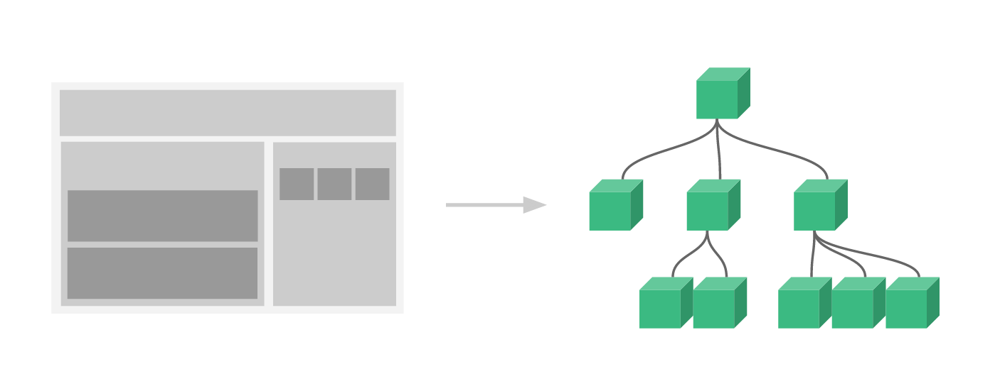

#  Vue.js学习体会——入门
2018年9月29日&emsp;&emsp;周雪振(5141509091)
___

## 一、Vue是什么
>&emsp;&emsp;Vue (读音 /vjuː/，类似于 view) 是一套用于构建用户界面的渐进式框架。与其它大型框架不同的是，Vue 被设计为可以自底向上逐层应用。Vue 的核心库只关注视图层，不仅易于上手，还便于与第三方库或既有项目整合。另一方面，当与现代化的工具链以及各种支持类库结合使用时，Vue 也完全能够为复杂的单页应用提供驱动。

 ---

## 二、Vue.js最简单的使用方法
```js
<script src="https://cdn.jsdelivr.net/npm/vue/dist/vue.js"></script>
```
## 三、声明式渲染, 数据和 DOM 被建立了关联，所有东西都是响应式的
```
<div id="app">
  {{ message }}
</div>

var app = new Vue({
  el: '#app',
  data: {
    message: 'Hello Vue!'
  }
})
```
## 四、`v-bind`绑定元素的的属性
```
<div id="app-2">
  <span v-bind:title="message">
    鼠标悬停几秒钟查看此处动态绑定的提示信息！
  </span>
</div>

var app2 = new Vue({
  el: '#app-2',
  data: {
    message: '页面加载于 ' + new Date().toLocaleString()
  }
})
```

## 五、`v-if`条件控制
```
<div id="app-3">
  <p v-if="seen">现在你看到我了</p>
</div>

var app3 = new Vue({
  el: '#app-3',
  data: {
    seen: true
  }
})
```

## 六、`v-for`循环控制
```
<div id="app-4">
  <ol>
    <li v-for="todo in todos">
      {{ todo.text }}
    </li>
  </ol>
</div>

var app4 = new Vue({
  el: '#app-4',
  data: {
    todos: [
      { text: '学习 JavaScript' },
      { text: '学习 Vue' },
      { text: '整个牛项目' }
    ]
  }
})
```

## 七、`v-on`事件监听
```
<div id="app-5">
  <p>{{ message }}</p>
  <button v-on:click="reverseMessage">逆转消息</button>
</div>

var app5 = new Vue({
  el: '#app-5',
  data: {
    message: 'Hello Vue.js!'
  },
  methods: {
    reverseMessage: function () {
      this.message = this.message.split('').reverse().join('')
    }
  }
})
```
&emsp;&emsp;**注意在 reverseMessage 方法中，我们更新了应用的状态，但没有触碰 DOM——所有的 DOM 操作都由 Vue 来处理，你编写的代码只需要关注逻辑层面即可。**

## 八、`v-model`双向绑定
```
<div id="app-6">
  <p>{{ message }}</p>
  <input v-model="message">
</div>

var app6 = new Vue({
  el: '#app-6',
  data: {
    message: 'Hello Vue!'
  }
})
```

## 九、Vue.component组件化应用构建
>&emsp;&emsp;组件系统是 Vue 的另一个重要概念，因为它是一种抽象，允许我们使用小型、独立和通常可复用的组件构建大型应用。仔细想想，几乎任意类型的应用界面都可以抽象为一个组件树：  


&emsp;&emsp;在 Vue 里，一个组件本质上是一个拥有预定义选项的一个 Vue 实例。在 Vue 中注册组件很简单：
```
Vue.component('todo-item', {
  template: '<li>这是个待办项</li>'
})

<ol>
  <!-- 创建一个 todo-item 组件的实例 -->
  <todo-item></todo-item>
</ol>
```
&emsp;&emsp;但是这样会为每个待办项渲染同样的文本，这看起来并不炫酷。我们应该能从父作用域将数据传到子组件才对。让我们来修改一下组件的定义，使之能够接受一个 prop：
```HTML
<div id="app-7">
  <ol>
    <todo-item
      v-for="item in groceryList"
      v-bind:todo="item"
      v-bind:key="item.id">
    </todo-item>
  </ol>
</div>

Vue.component('todo-item', {
  props: ['todo'],
  template: '<li>{{ todo.text }}</li>'
})

var app7 = new Vue({
  el: '#app-7',
  data: {
    groceryList: [
      { id: 0, text: '蔬菜' },
      { id: 1, text: '奶酪' },
      { id: 2, text: '随便其它什么人吃的东西' }
    ]
  }
})
```
---